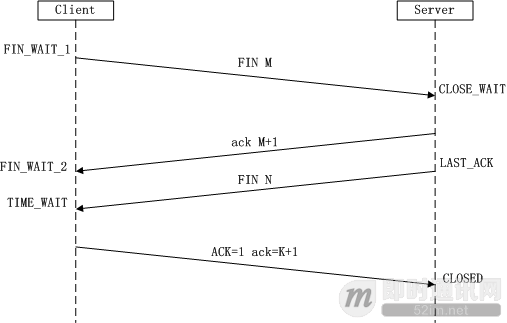

# php
## php基础
### 底层原理
#### PHP一次请求的生命周期
    第一阶段：SAPI接口,模块初始化阶段
    第二阶段：请求初始化阶段
    第三阶段：php脚本执行阶段
    第四阶段：请求结束阶段
    参考链接：http://www.noobyard.com/article/p-haihkowd-vn.html
#### PHP语言的整体架构图(包括其核心的组成模块即可)

   

    Application: 程序员编写的 PHP 程序，无论是 Web 应用还是 Cli 方式运行的应用都是上层应用，
    PHP 程序员主要工作就是编写它们。 
    
    SAPI:SAPI 是 Server Application Programming Interface 的缩写，中文为服务端应用编程接口，
    它通过一系列钩子函数使得 PHP 可以和外 围交换数据，SAPI 就是 PHP 和外部环境的代理器，
    它把外部环境抽象后，为内部的 PHP 提供一套固定的，统一的接口，使得 PHP 自身实现能够
    不受错综 复杂的外部环境影响，保持一定的独立性。 通过 SAPI 的解耦，PHP 可以不再考虑如
    何针对不同应用进行兼容，而应用本身也可以针对自己的特点实现不同的处理方式。 
    
    Extensions 扩展：常见的内置函数、标准库都是通过 extension 来实现的，这些叫做 PHP 的核心扩展，
    用户也可以根据自己的要求安装 PHP 的扩展 
    
    Zend 引擎:Zend 引擎是 PHP4 以后加入 PHP 的，是对原有 PHP 解释器的重写，整体使用 C 语言进行开发，
    也就是说可以把 PHP 理解成用 C 写的 一个编程语言软件，引擎的作用是将 PHP 代码翻译为一种叫 
    opcode 的中间语言，它类似于 JAVA 的 ByteCode（字节码）。 引擎对 PHP 代码会执行四个: 
    	1. 词法分析 Scanning（Lexing），将 PHP 代码转换为语言片段（Tokens）。 
    	2. 解析 Parsing， 将 Tokens 转换成简单而有意义的表达式。 
    	3. 编译 Compilation，将表达式编译成 Opcode。 
    	4. 执行 Execution，顺序执行 Opcode，每次一条，以实现 PHP 代码所表达的功能 
    	APC、Opchche 这些扩展可以将 Opcode 缓存以加速 PHP 应用的运行速度，
    使用它们就可以在请求再次来临时省略前三步。 
    引擎也实现了基本的数据结构、内存分配及管理，提供了相应的 API 方法供外部调用。
    
#### PHP的垃圾回收集机制

    引擎在判断一个变量空间是否能够被释放的时候是依据这个变量的zval的refcount的值，
    如果refcount为0，那么变量的空间可以被释放，否则就不释放，这是一种非常简单的GC实现
    参考链接：https://cloud.tencent.com/developer/article/1723827
#### CgI、php-cgi、 Fastcgi、 php-fpm 几者的关系
    CGI:(Common Gateway Interface)通用网关接口
        HTTP服务器与你的或其它机器上的程序进行“交谈”的一种工具，
        其程序须运行在网络服务器上只要激活后，每次都要花费时间去fork一次
        缺点：每个请求一个新进程，进程间通信地址空间无法共享，
        限制了数据库连接、内存缓存等资源的重用。
    FastCGI:(Fast Common Gateway Interfac)快速通用网关接口
        FastCGI像是一个常驻(long-live)型的CGI，它可以一直执行着，只要激活后，
        不会每次都要花费时间去fork一次（这是CGI最为人诟病的fork-and-execute 模式）。
        它还支持分布式的运算，即 FastCGI 程序可以在网站服务器以外的主机上执行并
        且接受来自其它网站服务器来的请求。
	PHP-CGI是PHP自带的FastCGI管理器	
        PHP-CGI的不足：
        1.php-cgi变更php.ini配置后需重启php-cgi才能让新的php-ini生效，不可以平滑重启。
        2.直接杀死php-cgi进程，php就不能运行了。(PHP-FPM和Spawn-FCGI就没有这个问题，
        守护进程会平滑从新生成新的子进程。）
	PHP-FPM:(PHP-FastCGI Process Manager)
	    PHP专门的快速通用网关接口进程管理	
	    PHP-FPM是一个PHP FastCGI管理器，其实是PHP源代码的一个补丁   
	参考链接：https://www.biaodianfu.com/cgi-fastcgi-wsgi.html
#### fastCGI,Nginx之间是什么关系
    FastCGI 是一个协议，它是应用程序和 WEB 服务器连接的桥梁。
    Nginx 并不能直接与 PHP-FPM 通信，而是将请求通过 FastCGI 
    交给 PHP-FPM 处理。
    参考链接：
    https://www.cnblogs.com/liyuanhong/articles/11181537.html
    https://www.cnblogs.com/jianzhaojing/p/13623509.html
#### php五种运行模式
    
    1.CGI（通用网关接口/ Common Gateway Interface）
    2.FastCGI（常驻型CGI / Long-Live CGI）
    3.CLI（命令行运行 / Command Line Interface）
    4.Web模块模式（Apache等Web服务器运行的模式） 
    5.ISAPI（Internet Server Application Program Interface）
#### nginx如何调用PHP(nginx+php运行原理)
    1、nginx的worker进程直接管理每一个请求到nginx的网络请求。
    2、对于php而言，由于在整个网络请求的过程中php是一个cgi程序的角色，所以采用名为php-fpm的进程管理
    程序来对这些被请求的php程序进行管理。php-fpm程序也如同nginx一样，需要监听端口，并且有master和
    worker进程。worker进程直接管理每一个php进程。
    3、关于fastcgi：fastcgi是一种进程管理器，管理cgi进程。市面上有多种实现了fastcgi功能的进程管理器，
    php-fpm就是其中的一种。再提一点，php-fpm作为一种fast-cgi进程管理服务，会监听端口，一般默认监
    听9000端口，并且是监听本机，也就是只接收来自本机的
    端口请求，所以我们通常输入命令 netstat -nlpt|grep php-fpm 会得到：
    1   tcp 0  0 127.0.0.1:9000   0.0.0.0:*    LISTEN    1057/php-fpm
    这里的127.0.0.1:9000 就是监听本机9000端口的意思。
    4、关于fastcgi的配置文件，目前fastcgi的配置文件一般放在nginx.conf同级目录下，配置文件形式，
    一般有两种：fastcgi.conf  和 fastcgi_params。不同的nginx版本会有不同的配置文件，这两个配置文
    件有一个非常重要的区别：fastcgi_parames文件中缺少下列配置：
    fastcgi_param  SCRIPT_FILENAME    $document_root$fastcgi_script_name;
    我们可以打开fastcgi_parames文件加上上述行，也可以在要使用配置的地方动态添加。使得该配置生效。
    5、当需要处理php请求时，nginx的worker进程会将请求移交给php-fpm的worker进程进行处理，也就是最
    开头所说的nginx调用了php，其实严格得讲是nginx间接调用php。
#### 从浏览器输入URL到页面解析的全过程
    1.输入网址
    输入要访问的网址，即URL
    2.缓存解析
    浏览器获取URL后，先去缓存中查找资源，从浏览器缓存-系统缓存-路由器缓存中查看；
    如果有就从缓存中显示界面，不再发送请求；
    如果没有，则发送http请求；
    3.域名解析
    发现缓存中没有资源，发送http请求；
    在发送http请求之前，需要进行DNS解析(域名解析)；
    DNS解析：域名到IP地址的转换过程，域名的解析工作由DNS服务器完成，解析后可以获取域名相应的IP地址；
    4.tcp连接，三次握手
    在域名解析后，浏览器向服务器发起了http请求，tcp连接；
    因为tcp协议时面向连接的，所以在传输数据前必须建立连接，即三次握手；
    tcp连接建立后，浏览器开始向服务器发送http请求，请求数据包。请求信息包含一个头部和一个请求体；
    5.服务器收到请求
    服务器收到浏览器发送的请求信息，返回一个响应头和一个响应体。
    6.页面渲染
    浏览器收到服务器发送的响应头和响应体，进行客户端渲染,生成Dom树，解析css样式,js交互。
    参考地址：https://www.geek-share.com/detail/2796178796.html
### 常见函数
    array_pop() 删除数组的最后一个元素（出栈）。
    array_push() 将一个或多个元素插入数组的末尾（入栈）。
    array_shift() 删除数组中首个元素，并返回被删除元素的值。
    array_unshift() 在数组开头插入一个或多个元素。
    stripos() 返回字符串在另一字符串中第一次出现的位置（对大小写不敏感）。
    strpos() 返回字符串在另一字符串中第一次出现的位置（对大小写敏感）。
    strripos() 查找字符串在另一字符串中最后一次出现的位置（对大小写不敏感）。
    strrpos() 查找字符串在另一字符串中最后一次出现的位置（对大小写敏感）。
### PHP7与PHP5区别
    1、性能提升：PHP7比PHP5.0性能提升了两倍。
    2、以前的许多致命错误，现在改成抛出异常。
    3、PHP 7.0比PHP5.0移除了一些老的不在支持的SAPI（服务器端应用编程端口）和扩展。
    4、PHP 7.0比PHP5.0新增了空接合操作符。
    5、PHP 7.0比PHP5.0新增加了结合比较运算符。
    6、PHP 7.0比PHP5.0新增加了函数的返回类型声明。
    7、PHP 7.0比PHP5.0新增加了标量类型声明。
    8、PHP 7.0比PHP5.0新增加匿名类。
### 为什么 PHP7 比 PHP5 性能提升了？
    1、变量存储字节减小，减少内存占用，提升变量操作速度
    2、改善数组结构，数组元素和hash映射表被分配在同一块内
    存里，降低了内存占用、提升了 cpu 缓存命中率
    3、改进了函数的调用机制，通过优化参数传递的环节，减少了一些指令，提高执行效率
### 面向对象
#### 面向对象三大特性
    1. 封装
    封装，就是将客观事物抽象为逻辑实体，实体的属性和功能相结合，形成一个有机的整体。
    并对实体的属性和功能实现进行访问控制，向信任的实体开放，对不信任的实体隐藏。
    通过开放的外部接口即可访问，无需知道功能如何实现。
    封装主要有以下目的：
    1)可隐藏实体实现的细节。
    2)提高安全性，设定访问控制，只允许具有特定权限的使用者调用。
    3)简化编程，调用方无需知道功能是怎么实现的，即可调用。
    2. 继承
    3. 多态
    多态，是指一个类的同名方法，在不同情况下的实现细节不同。
    多态机制实现不同的内部实现结构共用同一个外部接口。
    多态有以下目的：
        1.一个外部接口可被多个同类使用。
        2.不同对象调用同个方法，可有不同实现。
    实现多态二种方式： 
        1.覆盖，是指子类重新定义父类的虚函数的做法。 
        2.重载，是指允许存在多个同名函数，而这些函数的参数表不同
        （或许参数个数不同，或许参数类型不同，或许两者都不同）
    参考链接：
    https://segmentfault.com/a/1190000021898422
    https://www.huaweicloud.com/articles/12538958.html
#### 面向对象的五大基本原则
    1.单一职责原则（SRP）
    2.开放封闭原则（OCP）
    3.里氏替换原则（LSP)
    4.依赖倒置原则（DIP)
    5.接口隔离原则   
#### 抽象类，接口的区别
    抽象类
    概念：抽象类不能创建实例，它只能作为父类被继承。抽象类是从多个具体类中抽象出来的父类，
    它具有更高层次的抽象。从多个具有相同特征的类中抽象出一个抽象类，以这个抽象类作为其子
    类的模板，从而避免了子类的随意性。
    特点：
    抽象类无法被实例化（因为它不是具体的类，但是有构造方法）
    抽象类有构造方法，是给子类创建对象的
    抽象类中可以定义抽象方法（在方法的修饰列表中添加abstract关键字，并且以“;”结束，不能
    带有“{}”）public abstract void m1();
    抽象类中不一定有抽象方法，抽象方法一定在抽象类中
    一个非抽象类继承抽象类，必须将抽象类中的抽象方法覆盖，实现，重写
    抽象类的成员特点：1）成员变量：既可以是变量也可以是常量。2）构造方法：有构造方法，用于
    子类访问父类数据的初始化。3）成员方法：抽象类中方法既可以是抽象的，也可以是非抽象方法
    在父类中，非抽象方法：子类继承，提高代码的复用性；抽象方法：强制要求子类做的事情
    抽象类中注意的问题：一个类如果没有抽象方法，可以是抽象类，即抽象类中可以完全没有抽象方法。
    这样类的主要目的就是不让创建该类对象。
    abstract关键字不可以与哪些关键字使用。
    1）private冲突：private修饰的成员不能被继承，从而不可以被子类重写，而abstract修饰的是
    要求被重写的。
    2）final冲突：final修饰的成员是最终成员，不能被重写，所以冲突，static无意义；
    3）static冲突；static修饰成员用类名可以直接访问，但是abstract修饰成员没有方法体，
    所以访问没有方法体的成员无意义。
    接口
    概念：接口的初步理解是一个特殊的抽象类，当抽象类中全部都是抽象方法时，可以通过接口的方式来体现。
    特点：
    1）接口不能被实例化
    2）接口只能包含方法的声明
    3）接口的成员方法包括方法，属性，索引器，事件
    4）接口中不能包含常量，字段(域)，构造函数，析构函数，静态成员
    抽象类和接口的区别：
    抽象类可以有构造方法，接口中不能有构造方法。
    抽象类中可以有普通成员变量，接口中没有普通成员变量
    抽象类中可以包含静态方法，接口中不能包含静态方法
    一个类可以实现多个接口，但只能继承一个抽象类
    接口可以被多重实现，抽象类只能被单一继承
    如果抽象类实现接口，则可以把接口中方法映射到抽象类中作为抽象方法而不必实现，
    而在抽象类的子类中实现接口中方法。
    接口和抽象类的相同点：
    都可以被继承
    都不能被实例化
    都可以包含方法声明
    派生类必须实现未实现的方法
    接口带来的最大好处就是避免了多继承带来的复杂性和低效性，并且同时可以提供多重继
    承的好处。接口和抽象类都可以提现多态性，但是抽象类对事物进行抽象，更多的是为了
    继承，为了扩展，为了实现代码的重用，子类和父类之间提现的是is-a关系，接口则更多的
    体现一种行为约束，一种规则，一旦实现了这个接口，就要给出这个接口中所以方法的具体
    实现，也就是实现类对于接口中所有的方法都是有意义是的。
    参考链接：https://www.huaweicloud.com/articles/4c46a18c83e3cc2f322b2cce65ba1700.html 
### 关键的字
#### 1.trait关键字用处
    Trait 是为类似 PHP 的单继承语言而准备的一种代码复用机制。Trait 为了减少单继承语言的限制，使开发人员能够
    自由地在不同层次结构内独立的类中复用 method。Trait 和 Class 组合的语义定义了一种减少复杂性的方式，避免
    传统多继承和 Mixin 类相关典型问题。
    解决php的单继承问题
#### 2.static关键字的作用，跟其他的属性有什么区别
#### 2.private,protected,public的区别
    > private只能在当前类中调用
    > protected能在当前类中调用也能在子类中调用
    > public可以到所有类中
### 正则使用
    1.用户邮箱
    "/^[a-zA-Z0-9-]+@[a-zA-Z0-9-]+(.[a-zA-Z0-9_-]+)+$/"; 
    2.手机号
    "/^1(3|4|5|6|7|8|9)\d{9}$/"; 
    3.获取https://test/fdasfsadf/808cd6.jpg图片名称与后最
        '/[^\/|.]+(?!.*\/)/'
    [^/]+ 表示匹配任意长度的字符串,字符串中不包含有字符 / ,可以把以/分割开的字符串全匹配到.
    .*/ 表示任意以/ 结尾的字符串,可以把后在带有/的字符串匹配到,前面再加上?!,再用圆括号包住
    表示排除掉.(?!.*/).整个表达式的意思就是匹配任意长度的不包含/ 的字符串,并把以/结尾的字符串排除掉.
 [参考链接：https://note.youdao.com](https://note.youdao.com/web/#/file/WEBd9fc02df9ec171264d86a28097fb9c6d/note/WEBfc04a8cadd692426e6b7e6357900ec17/)
### 常见问题
### 4.依赖注入/控制反转的原理与作用  
    原理：
    作用：1.减少系统的耦合度
          2.减少系统类的创建
### 5.自动加载原理
    https://segmentfault.com/a/1190000014948542
    1.启动
    <?php
      define('LARAVEL_START', microtime(true));
    
      require __DIR__ . '/../vendor/autoload.php';
      
    去 vendor 目录下的 autoload.php ：
    <?php
      require_once __DIR__ . '/composer' . '/autoload_real.php';
    
      return ComposerAutoloaderInit7b790917ce8899df9af8ed53631a1c29::getLoader();
      
    2.Composer自动加载文件
    3.autoload_real 引导类
        第一部分——单例
        第二部分——构造ClassLoader核心类
        第三部分 —— 初始化核心类对象
            autoload_static 静态初始化 ( PHP >= 5.6 )
            classMap（命名空间映射）
            ClassLoader 接口初始化（ PHP < 5.6 ）
            命名空间映射
        第四部分 —— 注册
            全局函数的自动加载
            静态初始化：
            普通初始化
            加载全局函数
        第五部分 —— 运行
        
    我们通过举例来说下上面代码的流程：
    如果我们在代码中写下 new phpDocumentor\Reflection\Element()，PHP 会通过
     SPL_autoload_register 调用 loadClass -> findFile -> findFileWithExtension。
     步骤如下：
    将 \ 转为文件分隔符/，加上后缀php，变成 $logicalPathPsr4, 
    即 phpDocumentor/Reflection//Element.php;
    利用命名空间第一个字母p作为前缀索引搜索 prefixLengthsPsr4 数组，查到下面这个数组：
            p' => 
                array (
                    'phpDocumentor\\Reflection\\' => 25,
                    'phpDocumentor\\Fake\\' => 19,
              )
    遍历这个数组，得到两个顶层命名空间 phpDocumentor\Reflection\ 和 phpDocumentor\Fake\
    在这个数组中查找 phpDocumentor\Reflection\Element，找出 phpDocumentor\Reflection\ 
    这个顶层命名空间并且长度为25。在prefixDirsPsr4 映射数组中得到phpDocumentor\Reflection\ 
    的目录映射为：
        'phpDocumentor\\Reflection\\' => 
            array (
                0 => __DIR__ . '/..' . '/phpdocumentor/reflection-common/src',
                1 => __DIR__ . '/..' . '/phpdocumentor/type-resolver/src',
                2 => __DIR__ . '/..' . '/phpdocumentor/reflection-docblock/src',
            ),
    遍历这个映射数组，得到三个目录映射；
    查看 “目录+文件分隔符//+substr(&dollar;logicalPathPsr4, &dollar;length)”文件是否存在，
    存在即返回。这里就是'__DIR__/../phpdocumentor/reflection-common/src + substr(phpDocumentor
    /Reflection/Element.php,25)'如果失败，则利用 fallbackDirsPsr4 数组里面的目录继续判断
    是否存在文件以上就是 composer 自动加载的原理解析！
    
## php框架
### Laravel
#### Laravel生命周期
    1、Laravel 采用了单一入口模式，应用的所有请求入口都是 public/index.php 文件。
    2、注册类文件自动加载器 : Laravel通过 composer 进行依赖管理，无需开发者手动导入各种类文件，、
    而由自动加载器自行导入。
    3、创建服务容器：从 bootstrap/app.php 文件中取得 Laravel 应用实例 $app (服务容器)
    创建 HTTP / Console 内核：传入的请求会被发送给 HTTP 内核或者 console 内核进行处理
    4、载入服务提供者至容器：在内核引导启动的过程中最重要的动作之一就是载入服务提供者到
    你的应用，服务提供者负责引导启动框架的全部各种组件，例如数据库、队列、验证器以及路由组件。
    5、分发请求：一旦应用完成引导和所有服务提供者都注册完成，Request 将会移交给路由进行
    分发。路由将分发请求给一个路由或控制器，同时运行路由指定的中间件
   
#### Laravel关键特性
    1.路由
    2.计划任务
    3.队列
    4.脚手架
    5.控制反转，依赖注入
#### Laravel中间件实现原理
    https://learnku.com/articles/5463/laravel-middleware-implementation-principle
#### Laravel artisan实现原理   
    https://learnku.com/articles/52949
### Yii2生命周期
    1.用户向入口脚本 web/index.php 发起请求。
    2.入口脚本加载应用配置并创建一个应用 实例去处理请求。
    3.应用通过请求组件解析请求的 路由。
    4.应用创建一个控制器实例去处理请求。
    5.控制器创建一个动作实例并针对操作执行过滤器。
    6.如果任何一个过滤器返回失败，则动作取消。
    7.如果所有过滤器都通过，动作将被执行。
    8.动作会加载一个数据模型，或许是来自数据库。
    9.动作会渲染一个视图，把数据模型提供给它。
    10.渲染结果返回给响应组件。
    11.响应组件发送渲染结果给用户浏览器。
 

### ThinkPHP生命周期
  

### 浅谈laravel框架与thinkPHP框架的区别
    1、渲染模版方式的不同:
    在Laravel框架里,使用return view()来渲染模版;
    而ThinkPHP里则使用了$this- display()的方式渲染模版;
    2、在Laravel框架里,由于其考虑到了跨站请求伪造, 所以如果使用form表单以post方式进行传值时,
    如果不再form表单中加入{{csrf_field()}}则会报出TokenMethodnotfound的语法错误;
    而TP框架则需要自己手动完成防止跨站攻击的代码;
    3、Laravel是一个重路由的框架(5.4),所有的功能都是由路由发起的,哪怕没有控制器方法,只要写了
    路由就能够访问,thinkPHP(3.2),必须要有控制器方法才能正常访问;
    4、laravel具有强大的社区化扩展，（composer扩展自动加载）;
    5、laravel具有强大的Blade模版引擎;
    6、中间件，Laravel特点，可以实现访问前后的处理，例如请求和返回，权限认证等;
    7、条件判断语句书写方式的差异:
    Laravel框架里 if else判断语句和foreach语句 书写时必须以@if开头 以@endif结尾,如果没有则报
    语法错误,@foreach @endforeach同理;
    而TP框架则和PHP语法规则使用方式一致直接ifesle语句判断和foreach循环遍历
    参考链接：https://cloud.tencent.com/developer/article/1723045
## 设计模式
### 1.单例模式
    class Singleton{
         private static $instance;
         public $a;
         public static function getInstance(){
            if(!(self::$instance instanceof self)){
                self::$instance = new self();
                
            } 
            return self::$instance;
         }
     }
     
     $first = Singleton::getInstance();
     $first->a = "zs";
     注：instanceof 用于确定一个 PHP 变量是否属于某一类 class 的实例
### 2.工厂模式
     class a {
         public function connect() {
             echo "A";
         }
     }
     class b {
         public function connect() {
             echo "B";
         }
     }
     class mysqlFactory{
         static public function factory($class_name){
             return new $class_name();
         }
     }
     
     $obj = mysqlFactory::factory('a');
     $obj->connect();
### 3.策略模式
    abstract class Strategy{
         public abstract function doAction($money);
     }
     
     class ManJianStrategy extends Strategy{
         public function doAction($money) {
             echo "满减算法：原价{$money}元";
         }
     }
     
     class DaZheStrategy extends Strategy{
         public function doAction($money) {
             echo "打折算法：原价{$money}元";
         }
     }
     
     class StrategyFind{
         private $strategy_mode;
         public function __construct($mode) {
             $this->strategy_mode = $mode;
         }
         public function get($money){
             $this->strategy_mode->doAction($money);
         }
     }
     
     
     $mode = new StrategyFind(new ManJianStrategy());
     $mode->get(100);
### 4.适配器模式
    `/**
      * 目标角色
      */
     interface Target2 {
      
         /**
          * 源类也有的方法1
          */
         public function sampleMethod1();
      
         /**
          * 源类没有的方法2
          */
         public function sampleMethod2();
     }
      
     /**
      * 源角色
      */
     class Adaptee2 {
      
         /**
          * 源类含有的方法
          */
         public function sampleMethod1() {
             echo 'Adaptee sampleMethod1  ';
         }
     }
      
     /**
      * 类适配器角色
      */
     class Adapter2 implements Target2 {
      
         private $_adaptee;
      
         public function __construct(Adaptee $adaptee) {
             $this->_adaptee = $adaptee;
         }
      
         /**
          * 委派调用Adaptee的sampleMethod1方法
          */
         public function sampleMethod1() {
             $this->_adaptee->sampleMethod1();
         }
      
         /**
          * 源类中没有sampleMethod2方法，在此补充
          */
         public function sampleMethod2() {
             echo 'Adapter sampleMethod2  ';
         }
      
     }
      
     class Client {
      
         /**
          * Main program.
          */
         public static function main() {
             $adaptee = new Adaptee2();
             $adapter = new Adapter2($adaptee);
             $adapter->sampleMethod1();
             $adapter->sampleMethod2();
      
         }
      
     }
### 5.门面模式
    interface Shape{
         public function draw();
     }
     
     class Circle implements Shape{
         public function draw() {
             echo "画一个原型";
         }
     }
     class Rectangle implements Shape{
         public function draw() {
             echo "画一个矩形";
         }
     }
     
     class Square implements Shape{
         public function draw() {
             echo "画一个正方形";
         }
     }
     
     class ShapeMark{
         public $circle;
         public $rectangle;
         public $square;
         public function __construct() {
             $this->circle = new Circle();
             $this->square = new Square();
             $this->rectangle = new Rectangle();
         }
         
         public function drawCircle(){
             $this->circle->draw();
         }
         public function drawSquare(){
             $this->square->draw();
         }
         public function drawRectangle(){
             $this->rectangle->draw();
         }
     }
     
     $shapemark = new ShapeMark();
     $shapemark->drawCircle();
     $shapemark->drawRectangle();
     $shapemark->drawSquare(); 
## 算法
### 常见的数据结构
#### 数组
#### 链表
#### 集合
#### 队列
#### 图
#### 树
### 五大常用算法总结
    1.穷举法
    穷举法简单粗暴，没有什么问题是搞不定的，只要你肯花时间。同时对于小数据量，
    穷举法就是最优秀的算法。就像太祖长拳，简单，人人都能会，能解决问题，但是
    与真正的高手过招，就颓了。
    2.贪婪算法
    贪婪算法可以获取到问题的局部最优解，不一定能获取到全局最优解，同时获取最
    优解的好坏要看贪婪策略的选择。
    3.动态规划算法
    4.分治算法
    分治算法就是把一个大的问题分为若干个子问题，然后在子问题继续向下分，一直到
    base cases，通过base cases的解决，一步步向上，最终解决最初的大问题。分治算
    法是递归的典型应用。
    5.回溯算法
    回溯算法是深度优先策略的典型应用，回溯算法就是沿着一条路向下走，如果此路不同了，
    则回溯到上一个分岔路，在选一条路走，一直这样递归下去，直到遍历万所有的路径。
    
    参考链接：https://blog.csdn.net/changyuanchn/article/details/51476281
### 10大排序算法
    非线性时间比较类排序：通过比较来决定元素间的相对次序，由于其时间复杂度不能突破
    O(nlogn)，因此称为非线性时间比较类排序。
    线性时间非比较类排序：不通过比较来决定元素间的相对次序，它可以突破基于比较排序
    的时间下界，以线性时间运行，因此称为线性时间非比较类排序。
 

    算法复杂度：　　
 
#### 1.冒泡排序
    思路：外层循环从1到n-1，内循环从当前外层的元素的下一个位置开始，依次和外层的元素
    比较，出现逆序就交换，通过与相邻元素的比较和交换来把小的数交换到最前面。
    $data = [23, 45, 8, 11, 10, 31, 55, 96, 30, 22];
     $len = count($data);
     
     for ($i = 0; $i < $len - 1; $i++) {
         for ($j = 0; $j < $len - $i - 1; $j++) {
             if ($data[$j + 1] < $data[$j]) {
                 $tmp = $data[$j + 1];
                 $data[$j + 1] = $data[$j];
                 $data[$j] = $tmp;
             }
         }
     }
     时间复杂度：最优o(n) 最差o(n*n)
     
#### 2.快速排序
    思路：通过一趟排序将待排记录分隔成独立的两部分，其中一部分记录的关键字均比另一部分
    的关键字小，则可分别对这两部分记录继续进行排序，以达到整个序列有序。
    function quick($originalData) {
         $lenght = count($originalData);
     
         if ($lenght <= 1) {
             return $originalData;
         }
         $pivot = threeMiddleValue($originalData, 0, $lenght - 1);
         $leftData = [];
         $rightData = [];
         for ($i = 0; $i < $lenght; $i++) {
             if ($originalData[$i] < $pivot) {
                 $leftData[] = $originalData[$i];
             } else if ($originalData[$i] > $pivot) {
                 $rightData[] = $originalData[$i];
             }
         }
         $leftData = quick($leftData);
         $rightData = quick($rightData);
         return array_merge($leftData, [$pivot], $rightData);
     }
     
     function threeMiddleValue($arr, $left, $right) {
         $result = null;
         $middle = floor(($left + $right) / 2);
         if ($arr[$left] > $arr[$right]) {
             if ($arr[$left] < $arr[$middle]) {
                 $result = $arr[$left];
             } else if ($arr[$right] > $arr[$middle]) {
                 $result = $arr[$right];
             } else {
                 $result = $arr[$middle];
             }
         } else {
             if ($arr[$right] < $arr[$middle]) {
                 $result = $arr[$right];
             } else if ($arr[$left] > $arr[$middle]) {
                 $result = $arr[$left];
             } else {
                 $result = $arr[$middle];
             }
         }
         return $result;
     }
     
     $testData = [7, 3, 10, 5, 1, 8];
     print_r(quick($testData));
     
     function quickSort($arr)
     {
         //先判断是否需要继续进行
         $length = count($arr);
         if ($length <= 1) {
             return $arr;
         }
         //选择第一个元素作为基准
         $base_num = $arr[0];
         //遍历除了标尺外的所有元素，按照大小关系放入两个数组内 //初始化两个数组
         $left_array = array(); //小于基准的
         $right_array = array(); //大于基准的
         for ($i = 1; $i < $length; $i++) {
             if ($base_num > $arr[$i]) {
                 // 放入左边数组
                 $left_array[] = $arr[$i];
             } else {
                 //放入右边
                 $right_array[] = $arr[$i];
             }
         }
         //再分别对左边和右边的数组进行相同的排序处理方式递归调用这个函数
         $left_array = quickSort($left_array);
         $right_array = quickSort($right_array);
         //合并
         return array_merge($left_array, array($base_num), $right_array);
     }
#### 3.选择排序
    思路：冒泡排序是通过相邻的比较和交换，每次找个最小值。选择排序是：首先在未排序序列
    中找到最小（大）元素，存放到排序序列的起始位置，然后，再从剩余未排序元素中继续寻找
    最小（大）元素，然后放到已排序序列的末尾。以此类推，直到所有元素均排序完毕。
    $data = [12, 55, 99, 22, 33, 25, 11, 44, 78];
     $len = count($data);
     for ($i = 0; $i < $len - 1; $i++) {
         $tmp = $data[$i];
         $tmpKey = $i;
         for ($j = $i; $j < $len; $j++) {
             if ($tmp > $data[$j]) {
                 $tmp = $data[$j];
                 $tmpKey = $j;
             }
         }
     
         if ($tmpKey != $i) {
             $data[$tmpKey] = $data[$i];
             $data[$i] = $tmp;
         }
     }
#### 4.堆排序
    思路：堆积是一个近似完全二叉树的结构，并同时满足堆积的性质：即子结点的键值或索引
    总是小于（或者大于）它的父节点。
#### 5.插入排序
    思路：通过构建有序序列，对于未排序数据，在已排序序列中从后向前扫描，找到相应位置
    并插入。可以理解为玩扑克牌时的理牌；
    $data = [155, 19, 88, 12, 40, 29, 1, 23];
     $len = count($data);
     
     for ($i = 0; $i < $len; $i++) {
         for ($j = $i; $j > 0; $j--) {
             if ($data[$j - 1] > $data[$j]) {
                 $tem = $data[$j - 1];
                 $data[$j - 1] = $data[$j];
                 $data[$j] = $tem;
             }else{
                 break;
             }
         }
     }
     print_r($data);
     
### 7大查找算法
#### 1.二分查找
    function binsearch($x, $a)
    {
        $c = count($a);
        $lower = 0;
        $high = $c - 1;
        while ($lower <= $high) {
            $middle = intval(($lower + $high) / 2);
            if ($a[$middle] > $x) {
                $high = $middle - 1;
            } elseif ($a[$middle] < $x) {
                $lower = $middle + 1;
            } else {
                return $middle;
            }
        }
        return false;
    }
#### 2.折半查找

### 二叉树
    前序：根结点 ---> 左子树 ---> 右子树
    中序：左子树---> 根结点 ---> 右子树
    后序：左子树 ---> 右子树 ---> 根结点
    层次遍历：按层次排序
    深度优先：
    广度优先：
### b树(B-树)
### b+树

## 场景开发
### 秒杀，抢购
    https://blog.csdn.net/qq_30089923/article/details/96886668
    抢购、秒杀实现很简单，但是有些问题需要解决，主要针对两个问题：
    一、高并发对数据库产生的压力
        用缓存技术就可以缓解数据库压力
    二、竞争状态下如何解决库存的正确减少（"超卖"问题）\
        优化方案1：将库存字段number字段设为unsigned，当库存为0时，
        因为字段不能为负数，将会返回false
        优化方案2：使用MySQL的事务，锁住操作的行
        优化方案3：使用非阻塞的文件排他锁
        使用redis队列，因为pop操作是原子的，即使有很多用户同时到达，
        也是依次执行，推荐使用（mysql事务在高并发下性能下降很厉害，
        文件锁的方式也是）
    三、企业针对超卖问题的处理
        1.mysql悲观锁
            SELECT * FROM employee WHERE id = 1 FOR UPDATE;
        2.mysql乐观锁
            update items set quantity=quantity-1,version=version+1 where id=100 and version=#{version};
            乐观锁不锁数据，而是通过版本号控制，会有不同结果返回给php，把决策权交给php。
        3.PHP+队列
            序列化，不会产生多个线程之间的冲突
        4.PHP+redis分布式锁，以及分布式锁主流优化方案
            $redis->setnx($key, $value);
            问题：会锁线程（100000个抢购请求并发过来，有100000个线程，但同一时刻只会有一
            个线程在执行业务代码，其它线程都在死循环中等待）。
            优化方式：设置设置更多的锁，比如抢购20个商品，就可以设置20个锁， 100000个人进来， 
            就有20个线程是在执行业务逻辑的，其它的就在等待。
        5.PHP+redis乐观锁 redis watch
            核心代码：
            $redis->watch("mywatchkey"); //声明一个乐观锁 
            $redis->multi(); //redis事务开始 
            $redis->set("mywatchkey",$mywatchkey+1); //乐观锁的版本号+1 
            $rob_result = $redis->exec();//redis事务提交
            优点如下：
            1. 首先选用内存数据库来抢购速度极快。
            2. 速度快并发自然没不是问题。
            3. 使用悲观锁，会迅速增加系统资源。
            4. 比队列强的多，队列会使你的内存数据库资源瞬间爆棚。
            5. 使用乐观锁，达到综合需求。
        6.nginx+lua+redis乐观锁
           
        7.mysql悲观锁与乐观锁总结
        乐观锁：不需要锁数据，性能高于悲观锁
        注：mysql悲观锁乐观锁都是在数据层面做处理，对于高并发
        情况会产生大量的死锁造成系统性能问题
        
    四、前段针对秒杀的优化
        首先要有一个展示秒杀商品的页面，在这个页面上做一个秒杀活动开始的倒计时，在准备阶段内用
        户会陆续打开这个秒杀的页面， 并且可能不停的刷新页面。这里需要考虑两个问题：
        1.秒杀前按钮是灰的，不能发送请求， 当然后端肯定也是要有判断。
        2.产品层面，用户点击“查询”或者“购票”后，按钮置灰，禁止用户重复提交请求;
        3.JS层面，限制用户在x秒之内只能提交一次请求;
        4.前端缓存，当用户一直刷新页面的时候， 前端可以到浏览器里面获取缓存数据。
## mysql
###  mysql流程

    MySQL 主要分为 Server 层和引擎层，
    Server 层主要包括连接器、查询缓存、分析器、优化器、执行器，同时还有一个日志模块（binlog），
    这个日志模块所有执行引擎都可以共用,redolog 只有 InnoDB 有。
    引擎层是插件式的，目前主要包括，MyISAM,InnoDB,Memory 等。
    SQL 等执行过程分为两类，一类对于查询等过程如下：
    权限校验—》查询缓存—》分析器—》优化器—》权限校验—》执行器—》引擎
    对于更新等语句执行流程如下：
    分析器----》权限校验----》执行器—》引擎—redo log prepare—》binlog—》redo log commit
    链接：
    https://www.jianshu.com/p/bc21e019e7ce
    https://www.cnblogs.com/annsshadow/p/5037667.html
    https://www.cnblogs.com/wyq178/p/11576065.html
### 1.mysql基础整理
#### MySQL的三大范式
    第一范式：每一列都是最小的不可再分割的，满足第一范式。
    第二范式：满足第一范式基础上，所有非主属性必须完全依赖主属性(可以是一个单独属性，也可以是多个属性组合)
    第三范式：满足第二范式基础上，属性不依赖其他非主属性。
#### 三个join的含义：
     left join（左联接）：返回左表中的所有记录以及和右表中的联接字段相等的记录。
     right join（右联接）：返回右表中的所有记录以及和左表中的联接字段相等的记录。
     inner join（等值联接）：只返回两个表中联接字段相等的记录。
     链接：https://www.jianshu.com/p/e7e6ce1200a4
#### MyISAM与InnoDB区别
    一、InnoDB支持事务，MyISAM不支持，这一点是非常之重要。
    二、MyISAM适合查询以及插入为主的应用，InnoDB适合频繁修改以及涉及到安全性较高的应用
    三、InnoDB支持外键，MyISAM不支持
    四、InnoDB支持行锁
#### 1.1 回表
    查询某个字段时先查的是主键再根据主键查找到对应字段
    即先定位主键值，再根据主键值定位行记录，性能相对于只扫描一遍聚集索引树的性能要低一些。
#### 1.1 索引覆盖
    指一个查询语句的执行只用从索引中就能够取得，不必从数据表中读取
    索引覆盖是一种避免回表查询的优化策略。具体的做法就是将要查询的数据作为索引列建立普通索引
    (可以是单列索引，也可以是联合索引)，
    这样的话就可以直接返回索引中的的数据，不需要再通过聚集索引去定位行记录，避免了回表的情况发生。    
### mysql事务隔离级别

#### 1.Read Uncommitted(读取未提交内容)
    (1)所有事务都可以看到其他未提交事务的执行结果 
    (2)本隔离级别很少用于实际应用，因为它的性能也不比其他级别好多少 
    (3)该级别引发的问题是——脏读(Dirty Read)：读取到了未提交的数据
#### 2.Read Committed(读取提交内容)
    (1)这是大多数数据库系统的默认隔离级别（但不是MySQL默认的） 
    (2)它满足了隔离的简单定义：一个事务只能看见已经提交事务所做的改变 
    (3)这种隔离级别出现的问题是——不可重复读(Nonrepeatable Read)：不可重复读意味着
    我们在同一个事务中执行完全相同的select语句时可能看到不一样的结果。
    导致这种情况的原因可能有：
    (1)有一个交叉的事务有新的commit，导致了数据的改变;
    (2)一个数据库被多个实例操作时,同一事务的其他实例在该实例处理其间可能会有新的commit
#### 3.Repeatable Read(可重读)
    (1)这是MySQL的默认事务隔离级别 
    (2)它确保同一事务的多个实例在并发读取数据时，会看到同样的数据行 
    (3)此级别可能出现的问题——幻读(Phantom Read)：当用户读取某一范围的数据行时，另一个事务又
    在该范围内插入了新行，当用户再读取该范围的数据行时，会发现有新的“幻影” 行 
    (4)InnoDB和Falcon存储引擎通过多版本并发控制(MVCC，Multiversion Concurrency Control)
    机制解决了幻读
#### 4.Serializable(可串行化)
    (1)这是最高的隔离级别 
    (2)它通过强制事务排序，使之不可能相互冲突，从而解决幻读问题。简言之,它是在每个读的
        数据行上加上共享锁。 
    (3)在这个级别，可能导致大量的超时现象和锁竞争
    
### mysql锁
#### 1.行锁
#### 2.表锁
#### 3.间隙锁（gap）
    说白了gap就是索引树中插入新记录的空隙。相应的gap lock就是加在gap上的锁，
    还有一个next-key锁，是记录+记前面的gap的组合的锁。
##### 3.1 订单如何防止间隙锁：
    1 尽量采用乐观锁，乐观锁是在php等代码层面的锁，就不会锁住数据库资源
    2 事务中update，where后面的字段尽量带上索引，不然间隙锁的范围很大
    3 尽量不要出现长事务，否则事务中更新订单时间隙锁会被锁很久，另一事务插入订单就会执行很久
    4 update订单表，begin和commit之间的时间不要太长，之间不要写一些慢代码，比如请求第三方接口
    5 分表能防止不分表情况下整张表被锁住。分表后是锁住众多表中的其中一张
#### 4.什么是死锁
    所谓死锁，是指多个进程在运行过程中因争夺资源而造成的一种僵局，当进程处于这种僵持状态时，
    若无外力作用，它们都将无法再向前推进。
#### 5.死锁怎么解决
    1. 等待，直到超时（innodb_lock_wait_timeout=10s）。
    2. 发起死锁检测，主动回滚一条事务，让其他事务继续执行（innodb_deadlock_detect=on）。
#### 3.如何避免发生死锁
    1. 操作完之后立即提交事务，特别是在交互式命令行中。比如中途不要去请求第三方接口或者
    执行一些慢逻辑，能不放到事务里面的php代码， 就别放到事务里面
    2. 资源一次性分配
        一次性锁协议，事务开始时，即一次性申请所有的锁，之后不会再申请任何锁，如果其中
        某个锁不可用，则整个申请就不成功，事务就不会执行，在事务尾端，一次性释放所有的
        锁。一次性锁协议不会产生死锁的问题，但事务的并发度不高。
    3.尽量采用乐观锁，因为悲观锁都是要求mysql锁资源，而乐观锁不是
    4. 采用超时设置，时间越短，锁等待时间越短。到点就会自动超时，不会继续等待锁释放
    5. 保证没有长事务，长事务尽量拆分成短事务，以为2个短事务很难重合到一起。就是说，
    如果一个事务瞬间执行完毕了，就很好，如果一直没执行完毕， 就很可能另外一个事务
    冲进来二者重合。就加大死锁几率
    6. 修改多个表或者多个行的时候，将修改的顺序保持一致。死锁是因为锁定
    资源的顺序刚好相反。如果顺序是一样的，就不会产生死锁。
    7. 创建索引，可以使创建的锁关联到的数据更少。如果where后面的字段没有索引，
    哪怕只操作一行数据， 也会锁整张表， 因为锁是基于索引的。    
	https://www.cnblogs.com/hhthtt/p/10707541.html
### mysql系统文件
### mysql索引
#### 从数据结构角度
    1、B+树索引(O(log(n)))：关于B+树索引，可以参考 MySQL索引背后的数据结构及算法原理
    2、hash索引：
    a 仅仅能满足"=","IN"和"<=>"查询，不能使用范围查询
    b 其检索效率非常高，索引的检索可以一次定位，不像B-Tree 索引需要从根节点到枝节点，
    最后才能访问到页节点这样多次的IO访问，所以 Hash 索引的查询效率要远高于 B-Tree 索引
    c 只有Memory存储引擎显示支持hash索引
    3、FULLTEXT索引（现在MyISAM和InnoDB引擎都支持了）
    4、R-Tree索引（用于对GIS数据类型创建SPATIAL索引）
#### 从物理存储角度
    1、聚集索引（clustered index）
    定义：数据行的物理顺序与列值（一般是主键的那一列）的逻辑顺序相同，一个表中
    只能拥有一个聚集索引。--->主键索引
    2、非聚集索引（non-clustered index）
    定义：该索引中索引的逻辑顺序与磁盘上行的物理存储顺序不同，一个表中可以拥有
    多个非聚集索引。--->普通索引
    聚集索引和非聚集索引的区别如下：
    1、使用聚集索引的查询效率要比非聚集索引的效率要高，但是写入性能并不高。因为如果
    需要频繁去改变聚集索引的值，则需要移动对应数据的物理位置；
    2、非聚集索引在查询的时候可以的话就避免二次查询，这样性能会大幅提升；
    3、不是所有的表都适合建立索引，只有数据量大表才适合建立索引，且建立在选择性高的
    列上面性能会更好。
    1) 聚集索引和非聚集索引的根本区别是表记录的排列顺序和与索引的排列顺序是否一致，
    聚集索引表记录的排列顺序与索引的排列顺序一致，优点是查询速度快，因为一旦
    具有第一个索引值的纪录被找到，具有连续索引值的记录也一定物理的紧跟其后。
    2) 聚集索引的缺点是对表进行修改速度较慢，这是为了保持表中的记录的物理顺序与索
    引的顺序一致，而把记录插入到数据页的相应位置，必须在数据页中进行数据重排，
    降低了执行速度。非聚集索引指定了表中记录的逻辑顺序，但记录的物理顺序和索引的顺序不
    一致，聚集索引和非聚集索引都采用了B+树的结构，但非聚集索引的叶子层并不与实际的
    总结：
    1.聚集索引查找速度比非聚集索引快,聚集索引的排序是顺序的
    2.聚集索引修改比较慢
    参考链接：https://www.huaweicloud.com/articles/ebd6b2fdd5848507351873a9ee4b0567.html
#### 从逻辑角度
    1、主键索引：主键索引是一种特殊的唯一索引，不允许有空值
    2、普通索引或者单列索引
    3、多列索引（复合索引）：复合索引指多个字段上创建的索引，只有在查询条件中使用
    了创建索引时的第一个字段，索引才会被使用。使用复合索引时遵循最左前缀集合
    4、唯一索引或者非唯一索引
    5、空间索引：空间索引是对空间数据类型的字段建立的索引，MYSQL中的空间数据类型有4种，
    分别是GEOMETRY、POINT、LINESTRING、POLYGON。MYSQL使用SPATIAL关键字进行扩展，使得
    能够用于创建正规索引类型的语法创建空间索引。创建空间索引的列，必须将其声明为NOT 
    NULL，空间索引只能在存储引擎为MYISAM的表中创建
    CREATE TABLE table_name[col_name data type]
    [unique|fulltext|spatial][index|key][index_name](col_name[length])[asc|desc]
    1、unique|fulltext|spatial为可选参数，分别表示唯一索引、全文索引和空间索引；
    2、index和key为同义词，两者作用相同，用来指定创建索引
    3、col_name为需要创建索引的字段列，该列必须从数据表中该定义的多个列中选择；
    4、index_name指定索引的名称，为可选参数，如果不指定，MYSQL默认col_name为索引值；
    5、length为可选参数，表示索引的长度，只有字符串类型的字段才能指定索引长度；
    6、asc或desc指定升序或降序的索引值存储
#### B+Tree相对于B-Tree有几点不同
    非叶子节点只存储键值信息。
    所有叶子节点之间都有一个链指针。
    数据记录都存放在叶子节点中。
#### 为什么B-tree 不适合mysql 查询
    第一：B-树的每个节点都有data域（指针），这无疑增大了节点大小，说白了增加了磁盘IO次数
    （磁盘IO一次读出的数据量大小是固定的，单个数据变大，每次读出的就少，IO次数增多，一次
    IO多耗时啊！），而B+树除了叶子节点其它节点并不存储数据，节点小，磁盘IO次数就少。这是
    优点之一。
    第二：B+树所有的Data域在叶子节点，一般来说都会进行一个优化，就是将所有的叶子节点用指针
    串起来。这样遍历叶子节点就能获得全部数据，这样就能进行区间访问啦
    参考链接：https://blog.csdn.net/ahjxhy2010/article/details/105200801
    
### 索引设计的原则
    1）适合索引的列是出现在where子句中的列，或者连接子句中指定的列；
    2）基数较小的类，索引效果较差，没有必要在此列建立索引；
    3）使用短索引，如果对长字符串列进行索引，应该指定一个前缀长度，这样能够节省大量索引空间；
    4）不要过度索引。索引需要额外的磁盘空间，并降低写操作的性能。在修改表内容的时候，索引会进
    行更新甚至重构，索引列越多，这个时间就会越长。所以只保持需要的索引有利于查询即可。
### mysql索引失效的情况：
    索引字段使用函数表达式
    索引字段使用like，以%开头如：like %id;--不使用索引；like id%--可以使用索引
    or的使用，但并不是所有的or都会使索引失效，如果or连接的所有条件字段都设置了索引，
    那么还是会走索引的；一旦有一个条件没有建立索引，那么就会走全表扫描。
    如果创建多列索引，必须所有的列都用来where的查询条件的时候，索引才会有效
    字符串类型的索引，当做查询条件的时候必须给字段加上单引号，才会走索引。
    where条件中使用了!= <>，不走索引
    where后面的条件使用了表达式--不走索引
    where后面使用not in不走索引；in是走索引的
    where条件使用is not null时不走索引；is null是走索引的。
    如果mysql估计使用全表扫描要比使用索引快,则不使用索引
    此时可以采用强制索引
    FORCE INDEX ( pushcert_date )
    

参考链接 ：

https://zhuanlan.zhihu.com/p/61687047

https://segmentfault.com/a/1190000021464570

### mysql索引优化思路
    （1）能用唯一索引不要用普通索引，能用组合索引尽量不用单列索引。
    （2）索引不会走包含有NULL的列，只要列中包含有NULL值，都将不会被包含在索引中，组合索引中只要有一列含有NULL值，
    那么这一列对于此组合索引就是无效的。
    （3）order by与group by后的字段需要结合where条件的字段建组合索引，并且order by的字段一般放在组合索引的最后才
    有效。
    （4）查询语句如果使用组合索引，组合索引的第一个字段一定要在where条件中，否则该索引是不会走的。需保证组合索引
    的字段顺序，若使用组合索引后面的字段，最好前面的字段也在where条件中，
    否则即使mysql筛选器使ff用了该索引，该索引后面的字段也可能没用到。
    （5）查询语句中包含时间范围的时间字段在组合索引的最后，因为只要是范围的字段，组合索引后面的字段就没用。
    （6）如果查询语句包含时间范围的时间字段，为保证mysql筛选器能筛选到时间字段的组合索引或能使用到组合索引里的时
    间字段，
    order by的字段尽量加上该时间字段，或者只要能保证不走order by的字段的单个索引也可。
    （7）查询语句中包含order by时，如果order by是主键字段或单列索引字段，此时需注意mysql索引筛选器可能会按主键索引
    或单列索引查询，导致全表扫描（type=index），CPU飙升。
    （8）若一个表索引较多，为防止mysql筛选器选择不必要的索引导致查询较慢，可以指定索引进行查询（force index强制使用
    索引、ignore index忽略某些索引），如无必要，尽量不要指定。
    （9）一个表的索引个数最好不要超过5~6个，每个索引都需要占用磁盘空间，索引越多，需要的磁盘空间就越大。
    （10）使用短索引（提高查询速度、节省磁盘空间和I/O操作）：尽量使用字段数据量少的索引；大字段的索引，需使用前缀索
    引，但最好不要在大字段上使用索引。
    （11）一个组合索引的字段数量不是越多越好，一个查询语句的组合条件会变，只要使用经常查询的字段即可，
    并且组合索引的字段在查询语句中的值区分度越高越好，比如print_flag有0和1两个值，但是0的值特别少，用户大部分都是使
    用0来查询。
    （12）不鼓励使用like操作，like ‘%aaa%’不会使用索引，而like ‘aaa%’可以使用索引。
    （13）不使用NOT IN 、<>、！=操作，但<,<=，=，>,>=,BETWEEN,IN是可以用到索引的。
    （14）如果where字句的查询条件里使用了函数(如：where DAY(column)=…),mysql将无法使用索引。
    （15）在join操作中(需要从多个数据表提取数据时)，mysql只有在主键和外键的数据类型相同时才能使用索引，否则及时建立了
    索引也不会使用。
    
    mysql慢日志分析工具
    mysqldumpslow -t 10 ./slowquery.log --查询时间最长的前10 SQL语句
    mysqldumpslow -s c -t 10 ./slowquery.log --访问次数最多的前10 sql语句
    mysqldumpslow -s r -t 10 ./slowquery.log --返回最多的前10 sql语句
    
    
    如何通过 pt-query-digest 慢查询日志发现有问题的 sql
    1）查询次数多且每占用时间长的 sql
    通常为 pt-query-digest 分析的前几个查询
    2）IO 消耗大的 sql
    注意 pt-query-digest 分析中的 Rows examine 项
    3）为命中索引的 sql
    注意 pt-query-digest 分析中 Rows examine （扫描行数） 和 Rows sent （发送行数）的对比,如果扫描行数
    远远大于发送行数，则说明索引命中率并不高。
    参考链接：https://blog.csdn.net/liuhaiabc/article/details/88682802

### 主从延时
    我们可以使用percona-toolkit工具做校验，而该工具包含 
    1. pt-table-checksum 负责检测MySQL主从数据一致性 
    2. pt-table-sync负责挡住从数据不一致时修复数据，让他们保存数据的一致性 
    3. pt-heartbeat 负责监控MySQL主从同步延迟
    
    1)、架构方面
    1.业务的持久化层的实现采用分库架构，mysql服务可平行扩展，分散压力。
    2.单个库读写分离，一主多从，主写从读，分散压力。这样从库压力比主库高，保护主库。
    3.服务的基础架构在业务和mysql之间加入memcache或者redis的cache层。降低mysql的读压力。
    4.不同业务的mysql物理上放在不同机器，分散压力。
    5.使用比主库更好的硬件设备作为slave总结，mysql压力小，延迟自然会变小。
    2)、硬件方面
    1.采用好服务器，比如4u比2u性能明显好，2u比1u性能明显好。
    2.存储用ssd或者盘阵或者san，提升随机写的性能。
    3.主从间保证处在同一个交换机下面，并且是万兆环境。
    总结，硬件强劲，延迟自然会变小。一句话，缩小延迟的解决方案就是花钱和花时间。
    1)、mysql主从复制存在的问题：  
    ● 主库宕机后，数据可能丢失  
    ● 从库只有一个sql Thread，主库写压力大，复制很可能延时
    2)、解决方法：  
    ● 半同步复制---解决数据丢失的问题  
    ● 并行复制----解决从库复制延迟的问题
    https://www.huaweicloud.com/articles/508e95b7494d24b6f70a1621b63c5567.html
### 分库分表
    垂直分库
    水平分库
    垂直分表
    水品分表
    异构索引表
    分库分表使用场景
    1.订单分库分表
### 分布式事务
	https://www.cnblogs.com/jajian/p/10014145.html
	xa事务
	2pc(两阶段提交)：第一次提交时准备操作，第二次提交时真正的提交
	-------------->产生的问题：数据不一致
    3pc(三阶段提交)：在2pc的基础上多了一次消息通知的阶段住要 第一次提交完了通知第二次进行提交
    	--------->mysql官方暂时未实现
    tcc(TCC两阶段补偿型)：在2pc的基础上使用接口来处理事务的回滚操作
	mq(最终一致性，幂等性)：使用rabbit ack高级特性
## 分布式事务行业主要解决方案介绍
#### 两阶段提交（2PC）（two-phase commit protocol）xa事务就是apc
    第一阶段：请求/表决阶段
    第二阶段：提交/执行阶段（正常流程）
    第二阶段：提交/执行阶段（异常流程）
    遇到的一些问题：
       1.性能问题
       2.协调者单点故障问题
       3.丢失消息导致的数据不一致问题
#### 三阶段提交（3PC）
    三阶段提交又称3PC，其在两阶段提交的基础上增加了CanCommit阶段，
    并引入了超时机制。一旦事务参与者迟迟没有收到协调者的Commit请求，
    就会自动进行本地commit，这样相对有效地解决了协调者单点故障的问题。
    3PC解决了2PC1,2问题但是任然没有完全解决数据不一致的问题
#### 补偿事务（TCC）
    Try阶段：主要是对业务系统做检测及资源预留。
    Confirm阶段：确认执行业务操作。 通过调用确认接口
    Cancel阶段：取消执行业务操作。 通过调用取消接口
    不足之处则在于对应用的侵入性非常强，业务逻辑的每个分支都需要实现try、confirm、cancel
    三个操作。此外，其实现难度也比较大，需要按照网络状态、系统故障等不同的失败原因实现
    不同的回滚策略
#### MQ最终一致性事务
    1 消息百分百投递成功
    结合comfirm机制
    2 消息百分百消费成功
    结合ack机制
    并且要解决幂等性问题
### 高可用
#### MHA
##### 1.MHA原理
    1. 从宕机崩溃的master保存二进制日志事件（binlog events） 
    2. 识别含有最新更新的slave 
    3. 应用差异的中继日志（relay log）到其他的slave；
    4. 应用从master保存的二进制日志事件（binlog events）； 
    5. 提升一个slave为新的master； 
    6. 使其他的slave连接新的master进行复制；

## redis
### redis 与 memcached对比
    1、数据类型支持不同
    2、内存管理机制不同
    3、数据持久化支持
    Redis虽然是基于内存的存储系统，但是它本身是支持内存数据的持久化的，而且提供两种
    主要的持久化策略：RDB快照和AOF日志。而memcached是不支持数据持久化操作的。
    4、性能不同
    由于Redis只使用单核，而Memcached可以使用多核，所以平均每一个核上Redis在存储小数
    据时比Memcached性能更高。而在100k以上的数据中，Memcached性能要高于Redis，
    虽然Redis也在存储大数据的性能上进行了优化，但是比起Memcached，还是稍有逊色。
    5、集群管理的不同
    https://cloud.tencent.com/developer/article/1004377
### redis list,hash,set使用比较慢的命令为什么慢
    hgetall、lrange、smembers、zrange
    参考链接：https://juejin.cn/post/6855129005172097031#heading-3
### redis为什么那么快
    1.完全基于内存，没有磁盘IO上的开销
    2.数据结构简单
    3.采用单线程避免了多个线程之间线程切换和锁资源争用的开销
    4.使用多路io复用模型，非阻塞io
    5.使用底层epoll
#### redis为什么是单线程  
    因为Redis是基于内存的操作，CPU不是Redis的瓶颈，Redis的瓶颈最有可能是机器内存的大
    小或者网络带宽。既然单线程容易实现，而且CPU不会成为瓶颈，那就顺理成章地采用单线
    程的方案了。
### 主从复制
    全量复制
    1.Redis 内部会发出一个同步命令，刚开始是 Psync 命令，Psync ? -1表示要求 master 主机同步数据
    2.机会向从机发送 runid 和 offset，因为 slave 并没有对应的 offset，所以是全量复制
    3.从机 slave 会保存 主机master 的基本信息 save masterInfo
    4.主节点收到全量复制的命令后，执行bgsave（异步执行），在后台生成RDB文件（快照），并使用一个
    缓冲区（称为复制缓冲区）记录从现在开始执行的所有写命令
    5.主机send RDB 发送 RDB 文件给从机
    6.发送缓冲区数据
    7.刷新旧的数据，从节点在载入主节点的数据之前要先将老数据清除
    8.加载 RDB 文件将数据库状态更新至主节点执行bgsave时的数据库状态和缓冲区数据的加载。

    部分复制
    1.如果网络抖动（连接断开 connection lost）
    2.主机master 还是会写 replbackbuffer（复制缓冲区）
    3.从机slave 会继续尝试连接主机
    4.从机slave 会把自己当前 runid 和偏移量传输给主机 master，并且执行 pysnc 命令同步
    5.如果 master 发现你的偏移量是在缓冲区的范围内，就会返回 continue 命令
    6.同步了 offset 的部分数据，所以部分复制的基础就是偏移量 offset。
 
### 持久化
    RDB手可以手动触发和自动触发：
    ·手动触发：save 和 bgsave ，bgsave 是主流的触发 RDB 持久化方式
    ·自动触发：
        # 900s内至少达到一条写命令 save 900 1 
        # 300s内至少达至10条写命令 save 300 10 
        # 60s内至少达到10000条写命令 save 60 10000
    AOF 重写过程可以手动触发和自动触发：
    ·手动触发：直接调用 bgrewriteaof 命令。 
    ·自动触发：根据 auto-aof-rewrite-min-size和auto-aof-rewrite-percentage 参数确定自动触发时机。
### 哨兵原理
    
    1.检测问题，主要讲的是三个定时任务，这三个内部的执行任务可以保证出现问题马上让 Sentinel 知道。 
    2.发现问题，主要讲的是主观下线和客观下线。当有一台 Sentinel 机器发现问题时，它就会主观对它主
    观下线。但是当多个 Sentinel 都发现有问题的时候，才会出现客观下线。 
    3.找到解决问题的人，主要讲的是领导者选举，如何在 Sentinel 内部多台节点做领导者选举，选出一个
    领导者。 
    4.解决问题，主要讲的是故障转移，即如何进行故障转移
        1. 三个定时任务
        每10秒每个 Sentinel 对 Master 和 Slave 执行一次 Info Replication 。 
        每2秒每个 Sentinel 通过 Master 节点的 channel 交换信息（pub/sub）。 
        每1秒每个 Sentinel 对其他 Sentinel 和 Redis 执行 pin 
        第一个定时任务，指的是 Redis Sentinel 可以对 Redis 节点做失败判断和故障转移，在 Redis 内部有
        三个定时任务作为基础，来 Info Replication 发现 Slave 节点， 这个命令可以确定主从关系。 
        第二个定时任务，类似于发布订阅， Sentinel 会对主从关系进行判定，通过 sentinel:hello 频道交互。
        了解主从关系可以帮助更好的自动化操作 Redis 。然后 Sentinel 会告知系统消息给其它 Sentinel 节点，
        最终达到共识，同时 Sentinel节点能够互相感知到对方。 
        第三个定时任务，指的是对每个节点和其它 Sentinel 进行心跳检测，它是失败判定的依据
### 集群
#### 集群的几种方式（https://blog.csdn.net/drdongshiye/article/details/84204392）
	一、单节点实例
	二、主从模式（master/slaver）
	三、sentinel模式
	四、cluster模式
### 内存优化
#### 1.内存淘汰策略
    noenviction：不清除数据，只是返回错误，这样会导致浪费掉更多的内存，对大多数写命令
    （DEL 命令和其他的少数命令例外）
    allkeys-lru：从所有的数据集中挑选最近最少使用的数据淘汰，以供新数据使用
    volatile-lru：从已设置过期时间的数据集中挑选最近最少使用的数据淘汰，以供新数据使用
    allkeys-random：从所有数据集中任意选择数据淘汰，以供新数据使用
    volatile-random：从已设置过期时间的数据集中任意选择数据淘汰，以供新数据使用
    volatile-ttl：从已设置过期时间的数据集中挑选将要过期的数据淘汰，以供新数据使用
    volatile-lfu：从所有配置了过期时间的键中淘汰使用频率最少的键
    allkeys-lfu：从所有键中淘汰使用频率最少的键
### 常见问题
#### 1.缓存穿透：查询一个数据库一定不存在的数据
    解决：
    1)增加用户鉴权校验
    2）布隆过滤器
    3）设置空值缓存对象
#### 2.缓存击穿：对于一些设置了过期时间key值如果这些值可能会在某些时间
    点被超高并发的访问，是一种非常“热点”的数据
    解决：
    1）设置热点数据用不过期
    2）加互斥锁
    3）提前加互斥锁，在读取数据时重新更新缓存
#### 3.缓存雪崩：缓存大量失效，导致大量请求都直接向数据库获取数据，造成数据库
    的压力
    解决；
    1）加锁降低数据库压力
    2）设置redis过期时间上时加一个随机数避免大批数据过期
    3）部署分布式redis，在一台redis服务器故障时，立刻将请求转移到另一台服务器
#### 4.如何保证缓存与数据库双写一致性
    1）先更新数据库，后更新缓存
    2）先更新数据库，后删除缓存
    3）先更新缓存，后更新数据库
    4）先删除缓存，后更新数据库
    参考链接：https://segmentfault.com/a/1190000039078249
    参考链接：http://kaito-kidd.com/2021/01/23/redis-slow-latency-analysis/
## elk
 

## rabbimq
    ACK（confirm机制） 
    如何保证消息百分百投递成功 
        方案一:消息信息落库,对消息状态进行打标(常见方案)
        方案二:消息的延迟投递，做二次确认，回调检查（不常用，大厂在用的高并发方案）
    幂等性 
        用户对于同一操作发起的一次请求或者多次请求的结果是一致的
        主流实现方案:唯一ID+指纹码
    return机制 
        用于处理一些不可路由的消息。也是生产段添加的一个监听。
    限流
        假设我们有这样的场景 Rabbitmq服务器有上万条未处理的消息,我们随便打开一个Con - Client,
        会造成:巨量的消息瞬间全部推送过来,然而我们单个客户端无法同时处理这么多数据!此时很有可
        能导致服务器崩溃，严重的可能导致线上的故障。 
        还有一些其他的场景，比如说单个Pro一分钟产生了几百条数据,但是单个Con一分钟可能只能处理
        60条,这个时候Pro-Con肯定是不平衡的。通常Pro是没办法做限制的。所以Con肯定需要做一些限流
        措施，否则如果 超出最大负载，可能导致Con性能下降，服务器卡顿甚至崩溃等一系列严重后果
    重回队列 
        重回队列是为了对没有处理成功的消息,将消息重新投递给Broker 
        重回队列,会把消费失败的消息重新添加到队列的尾端,供Con继续消费 
        一般在实际应用中,都会关闭重回队列,即设置为false
    TTL 
        TTL(Time To Live),即生存时间 
        RabbitMQ支持消息的过期时间，在消息发送时可以进行指定 
        RabbitMQ支持为每个队列设置消息的超时时间，从消息入队列开始计算，只要超过了队列的超时时间
        配置，那么消息会被自动清除
    死信队列
        DLX - 死信队列(dead-letter-exchange) 利用DLX,当消息在一个队列中变成死信 (dead message) 之后,
        它能被重新publish到另一个Exchange中,这个Exchange就是DLX
        使用场景：消息被拒绝(basic.reject / basic.nack),并且requeue = false 消息因TTL过期 
        队列达到最大长度

## kafka
    Kafka为什么那么快？
    1.Cache Filesystem Cache PageCache缓存
    2.顺序写 由于现代的操作系统提供了预读和写技术，磁盘的顺序写大多数情况下比随机写内存还要快。
    3.Zero-copy 零拷技术减少拷贝次数
    4.Batching of Messages 批量量处理。合并小的请求，然后以流的方式进行交互，直顶网络上限。
    5.Pull 拉模式 使用拉模式进行消息的获取消费，与消费端处理能力相符。 
## 常用Linux命令
    1.linux如何查看磁盘情况
    df -lh
    2.查找/usr目录下文件大小大于100MB的文件，并按照文件大小由大到小排列，并显示文件
      大小
    find / -type f -size +100M | xargs ls -lh -S
    1.查看物理CPU个数
    cat /proc/cpuinfo| grep "physical id"| sort| uniq| wc -l
    2.杀死全部php进程
    ps -ef | grep php | grep -v grep | awk '{print $2}' | xargs kill -s 9
    统计IP访问量
    awk '{print $1}' access.log | sort -n | uniq | wc -l
    查看访问最频繁的前100个IP
    awk '{print $1}' access.log | sort -n |uniq -c | sort -rn | head -n 100
    查看访问100次以上的IP
    awk '{print $1}' access.log | sort -n |uniq -c |awk '{if($1 >100) print $0}'|sort -rn
    参考链接：https://www.huaweicloud.com/articles/27a1172e6c9e7bab6555fda4fb0d7825.html
## 基于php的socket编程
    socket_create($net参数1，$stream参数2，$protocol参数3)
    作用：创建一个socket套接字，说白了，就是一个网络数据流。
    socket_connect($socket参数1,$ip参数2,$port参数3)
    作用：连接一个套接字，返回值为true或者false
    socket_bind($socket参数1,$ip参数2,$port参数3)
    作用：绑定一个套接字，返回值为true或者false
    socket_listen($socket参数1,$backlog 参数2)
    作用：监听一个套接字，返回值为true或者false
    socket_accept($socket)
    作用：接收套接字的资源信息，成功返回套接字的信息资源，失败为false
    socket_read($socket参数1,$length参数2)
    作用：读取套接字的资源信息，
    socket_write($socket参数1，$msg参数2，$strlen参数3)
    作用：把数据写入套接字中
    socket_close($socket)
    作用：关闭套接字
    
    常用程序：
    服务端
    <?php
    //创建服务端的socket套接流,net协议为IPv4，protocol协议为TCP
    $socket = socket_create(AF_INET, SOCK_STREAM, SOL_TCP);
    
    /*绑定接收的套接流主机和端口,与客户端相对应*/
    if (socket_bind($socket, '127.0.0.1', 8888) == false) {
        echo 'server bind fail:' . socket_strerror(socket_last_error());
        /*这里的127.0.0.1是在本地主机测试，你如果有多台电脑，可以写IP地址*/
    }
    //监听套接流
    if (socket_listen($socket, 4) == false) {
        echo 'server listen fail:' . socket_strerror(socket_last_error());
    }
    //让服务器无限获取客户端传过来的信息
    do {
        /*接收客户端传过来的信息*/
        $accept_resource = socket_accept($socket);
        /*socket_accept的作用就是接受socket_bind()所绑定的主机发过来的套接流*/
    
        if ($accept_resource !== false) {
            /*读取客户端传过来的资源，并转化为字符串*/
            $string = socket_read($accept_resource, 1024);
            /*socket_read的作用就是读出socket_accept()的资源并把它转化为字符串*/
    
            echo 'server receive is :' . $string . PHP_EOL;//PHP_EOL为php的换行预定义常量
            if ($string != false) {
                $return_client = 'server receive is : ' . $string . PHP_EOL;
                /*向socket_accept的套接流写入信息，也就是回馈信息给socket_bind()所绑定的主机客户端*/
                socket_write($accept_resource, $return_client, strlen($return_client));
                /*socket_write的作用是向socket_create的套接流写入信息，或者向socket_accept的套接流写入信息*/
            } else {
                echo 'socket_read is fail';
            }
            /*socket_close的作用是关闭socket_create()或者socket_accept()所建立的套接流*/
            socket_close($accept_resource);
        }
    } while (true);
    socket_close($socket);
    	
    客户端
    //创建一个socket套接流
    $socket = socket_create(AF_INET, SOCK_STREAM, SOL_TCP);
    /****************设置socket连接选项，这两个步骤你可以省略*************/
    //接收套接流的最大超时时间1秒，后面是微秒单位超时时间，设置为零，表示不管它
    socket_set_option($socket, SOL_SOCKET, SO_RCVTIMEO, array("sec" => 1, "usec" => 0));
    //发送套接流的最大超时时间为6秒
    socket_set_option($socket, SOL_SOCKET, SO_SNDTIMEO, array("sec" => 6, "usec" => 0));
    /****************设置socket连接选项，这两个步骤你可以省略*************/
    
    //连接服务端的套接流，这一步就是使客户端与服务器端的套接流建立联系
    if (socket_connect($socket, '127.0.0.1', 8888) == false) {
        echo 'connect fail massege:' . socket_strerror(socket_last_error());
    } else {
        $message = 'l love you 我爱你 socket';
        //转为GBK编码，处理乱码问题，这要看你的编码情况而定，每个人的编码都不同
        $message = mb_convert_encoding($message, 'GBK', 'UTF-8');
        //向服务端写入字符串信息
    
        if (socket_write($socket, $message, strlen($message)) == false) {
            echo 'fail to write' . socket_strerror(socket_last_error());
    
        } else {
            echo 'client write success' . PHP_EOL;
            //读取服务端返回来的套接流信息
            while ($callback = socket_read($socket, 1024)) {
                echo 'server return message is:' . PHP_EOL . $callback;
            }
        }
    }
    socket_close($socket);//工作完毕，关闭套接流	
        
## 网络
###  同步，异步，阻塞，非阻塞
    同步：就是在发出一个功能调用时，在没有得到结果之前，该调用就不返回。
    异步：和同步相对。当一个异步过程调用发出后，调用者不能立刻得到结果。
    实际处理这个调用的部件在完成后，通过状态、通知和回调来通知调用者
    阻塞：意思就是在哪里等待，要等别人执行完成才能往下去执行； 
    非阻塞：就是程序可以不用等待执行的结果， 就可以进行下一步的操作；
### 进程，线程，协成
    进程：进程，直观点说，保存在硬盘上的程序运行以后，会在内存空间里形成一个独立的内存体，
    这个内存体有自己独立的地址空间，有自己的堆，上级挂靠单位是操作系统。操作系统会以进程为单位，
    分配系统资源（CPU时间片、内存等资源），进程是资源分配的最小单位
    线程：有时被称为轻量级进程(Lightweight Process，LWP），是操作系统调度
    （CPU调度）执行的最小单位
    协程：是一种比线程更加轻量级的存在，协程不是被操作系统内核所管理，而完全是由程序所控制
    （也就是在用户态执行）。这样带来的好处就是性能得到了很大的提升，不会像线程切换那样消耗资源
### 三次握手
    所谓三次握手（Three-Way Handshake）即建立TCP连接，就是指建立一个
    TCP连接时，需要客户端和服务端总共发送3个包以确认连接的建立。在s
    ocket编程中，这一过程由客户端执行connect来触发，整个流程如下图所示：
   
  
    
    （1）第一次握手：
    Client将标志位SYN置为1，随机产生一个值seq=J，并将该数据包发送给Server，
    Client进入SYN_SENT状态，等待Server确认。
    （2）第二次握手：
    Server收到数据包后由标志位SYN=1知道Client请求建立连接，Server将标志
    位SYN和ACK都置为1，ack=J+1，随机产生一个值seq=K，并将该数据包发送给
    Client以确认连接请求，Server进入SYN_RCVD状态。
    （3）第三次握手：
    Client收到确认后，检查ack是否为J+1，ACK是否为1，如果正确则将标志位
    ACK置为1，ack=K+1，并将该数据包发送给Server，Server检查ack是否为K+1，
    ACK是否为1，如果正确则连接建立成功，Client和Server进入ESTABLISHED状态，
    完成三次握手，随后Client与Server之间可以开始传输数据了。
    
    为什么要3次握手
    防止已过期的连接请求报文突然又传送到服务器，因而产生错误。
### 四次挥手 
    所谓四次挥手（Four-Way Wavehand）即终止TCP连接，就是指断开一个TCP连接时，
    需要客户端和服务端总共发送4个包以确认连接的断开。在socket编程中，这一过
    程由客户端或服务端任一方执行close来触发，整个流程如下图所示：  

     
    
    第一次挥手：
    Client发送一个FIN，用来关闭Client到Server的数据传送，Client进入FIN_WAIT_1状态。
    第二次挥手：
    Server收到FIN后，发送一个ACK给Client，确认序号为收到序号+1
    （与SYN相同，一个FIN占用一个序号），Server进入CLOSE_WAIT状态。
    第三次挥手：
    Server发送一个FIN，用来关闭Server到Client的数据传送，
    Server进入LAST_ACK状态。
    第四次挥手：
    Client收到FIN后，Client进入TIME_WAIT状态，接着发送一个ACK给Server，
    确认序号为收到序号+1，Server进入CLOSED状态，完成四次挥手
    
    	先由客户端向服务器端发送一个FIN，请求关闭数据传输。
	当服务器接收到客户端的FIN时，向客户端发送一个ACK，其中ack的值等于FIN+SEQ
	然后服务器向客户端发送一个FIN，告诉客户端应用程序关闭。
	当客户端收到服务器端的FIN是，回复一个ACK给服务器端。其中ack的值等于FIN+SEQ
    	为什么要4次挥手？
    	确保数据能够完成传输。

	https://www.cnblogs.com/saolv/p/7807677.html
	
### 五大io模型
#### 阻塞IO：
    A拿着一支鱼竿在河边钓鱼，并且一直在鱼竿前等，在等的时候不做其他的事情，
    十分专心。只有鱼上钩的时，才结束掉等的动作，把鱼钓上来。
#### 非阻塞IO：
    B也在河边钓鱼，但是B不想将自己的所有时间都花费在钓鱼上，在等鱼上钩这个时间段中，
    B也在做其他的事情（一会看看书，一会读读报纸，一会又去看其他人的钓鱼等），
    但B在做这些事情的时候，每隔一个固定的时间检查鱼是否上钩。一旦检查到有鱼上钩，
    就停下手中的事情，把鱼钓上来。
#### 信号驱动IO：
    C也在河边钓鱼，但与A、B不同的是，C比较聪明，他给鱼竿上挂一个铃铛，
    当有鱼上钩的时候，这个铃铛就会被碰响，C就会将鱼钓上来。
#### IO多路转接：
    D同样也在河边钓鱼，但是D生活水平比较好，D拿了很多的鱼竿，一次性有很多鱼竿在等，
    D不断的查看每个鱼竿是否有鱼上钩。增加了效率，减少了等待的时间。
#### 异步IO：
    E也想钓鱼，但E有事情，于是他雇来了F，让F帮他等待鱼上钩，一旦有鱼上钩，
    F就打电话给E，E就会将鱼钓上去。
    参考链接：https://blog.csdn.net/qq_28613081/article/details/105998906?spm=1001.2014.3001.5501

### 网络模型
#### select 
    select机制的问题：
    1.每次调用select，都需要把fd_set集合从用户态拷贝到内核态，如果fd_set集合很大时，那这个
    开销也很大
    2.同时每次调用select都需要在内核遍历传递进来的所有fd_set，如果fd_set集合很大时，那这个
    开销也很大
    3.为了减少数据拷贝带来的性能损坏，内核对被监控的fd_set集合大小做了限制，并且这个是通过宏控
    制的，大小不可改变(限制为1024)
#### poll 
    poll的机制与select类似，与select在本质上没有多大差别，管理多个描述符也是进行轮询，根据描述
    符的状态进行处理，但是poll没有最大文件描述符数量的限制。也就是说，poll只解决了上面的问题3，
    并没有解决问题1，2的性能开销问题。
#### epoll
    是基于事件驱动的I/O方式，相对于select来说，epoll没有描述符个数限制，使用一个文件描述符管理多
    个描述符，将用户关心的文件描述符的事件存放到内核的一个事件表中，这样在用户空间和内核空间的
     copy只需一次。
#### reactor模型
    Reactor模式是处理并发I/O比较常见的一种模式，用于同步I/O，中心思想是将所有
    要处理的I/O事件注册到一个中心I/O多路复用器上，同时主线程/进程阻塞在多路复用器上；
    一旦有I/O事件到来或是准备就绪(文件描述符或socket可读、写)，多路复用器返回并将
    事先注册的相应I/O事件分发到对应的处理器中。
    Reactor是一种事件驱动机制，和普通函数调用的不同之处在于：应用程序不是主动的调用
    某个API完成处理，而是恰恰相反，Reactor逆置了事件处理流程，应用程序需要提供相应
    的接口并注册到Reactor上，如果相应的事件发生，Reactor将主动调用应用程序注册的接
    口，这些接口又称为“回调函数”。用“好莱坞原则”来形容Reactor再合适不过了：不要打电
    话给我们，我们会打电话通知你。
    Reactor模式与Observer模式在某些方面极为相似：当一个主体发生改变时，所有依属体
    都得到通知。不过，观察者模式与单个事件源关联，而反应器模式则与多个事件源关联 。
        
    
#### select,poll,epoll的区别：
    
    参考链接：https://www.jianshu.com/p/397449cadc9a    
### 进程间通讯的方式
	1.管道：速度慢，容量有限，只有父子进程能通讯    
	2.FIFO：任何进程间都能通讯，但速度慢    
	3.消息队列：容量受到系统限制，且要注意第一次读的时候，要考虑上一次没有读完数据的问题    
	4.信号量：不能传递复杂消息，只能用来同步    
	5.共享内存区：能够很容易控制容量，速度快，但要保持同步，比如一个进程在写的时候，另一个进程
	要注意读写的问题，相当于线程中的线程安全，当然，共享内存区同样可以用作线程间通讯，不过没
	这个必要，线程间本来就已经共享了同一进程内的一块内存
	参考链接：https://www.cnblogs.com/zgq0/p/8780893.html
### http常见状态码
    301 moved permanently 永久重定向，将用户的访问，重定向到某个url，
    当访问忘记最后加/,将301
    302 found 临时重定向，书签不会变更
    303 see other 临时重定向，希望get方法访问
    304 Not Modified（未修改）客户的缓存资源是最新的，要客户端使用缓存
    400 bad request 请求中有错误语法
    403 forbidden 访问被服务器拒绝，包括文件权限，防火墙等等
    404 not found 没有找到要访问资源
    407 Proxy Authentication Required(要求进行代理认证) 与状态码401类似， 
    用于需要进行认证的代理服务器
    408 Request Timeout（请求超时）如果客户端完成请求时花费的时间太长， 
    服务器可以回送这个状态码并关闭连接
    409 Conflict（冲突）发出的请求在资源上造成了一些冲突
    500 internel erver error 服务端执行请求时发生错误，可能web应用端存在bug
    502 Bad Gateway（网关故障）
        1.代理使用的服务器遇到了上游的无效响应
        2.若代理服务器+真实服务器，大部分情况下是真实服务器返回的请求失败，代理服务器才返回502
    503 service unavailable 服务器暂时属于超负载或者正在停机维护，无法处理请求。
    504 Gateway Time-out PHP-CGI已经执行，但是由于某种原因(一般是读取资源的问题)
    没有执行完毕而导致PHP-CGI进程终止。
    参考链接：https://tool.oschina.net/commons?type=5
### http常见响应头信息
    Content-Encoding
    Content-Length
    Content-Type
        几种常见的Content-Type类型
        一、application/x-www-form-urlencoded
        二、multipart/form-data
        三、application/json
        四、text/xml
        五、binary(application/octet-stream)
    Date
    Expires
    Last-Modified
### http常见请求头信息 
    Connection: keep-alive
    Host: api.olightstore.com
    Origin: https://www.olightstore.com
    Referer: https://www.olightstore.com/
    User-Agent: Mozilla/5.0 
### 常用的信号量
    1 SIGHUP 重新使进程读取配置文件
    2 SIGINT 关闭进程（十分暴力关闭）
    9 SIGKILL 终止进程 杀死进程/关闭进程（暴力关闭）
    10 SIGUSR1 终止进程 用户定义信号1 
    15 SIGTERM 关闭进程 (正常关闭)
    18 SIGCONT 恢复进程运行，相当于 bg 命令
    19 SIGSTOP 挂机进程，相当于ctrl+z
### 网络安全
    xss跨站脚本攻击
        通过表单注入js代码，当数据被执行的时候，跨域获取网站的数据
        防范：使用htmlspecialchars()将特殊字符转换为 HTML 实体
    csrf跨站请求伪造
        通过模拟表单上传用户信息 伪造用户 进行恶意提交
        防范：生成表单的时候给表单一个token，后台接受到数据的时候验证token
    点击劫持
        攻击者使用一个或多个透明的 iframe 覆盖在一个正常的网页上，然后诱使用
        户在该网页上进行操作，当用户在不知情的情况下点击透明的 iframe 页面时，
        用户的操作已经被劫持到攻击者事先设计好的恶意按钮或链接上
        劫持漏洞的防御：
        1.服务端：
            1、 X-FRAME-OPTIONS 机制
            2、 使用 FrameBusting 代码
            3、 使用认证码认证用户
        2.客户端
            1、 升级浏览器
            2、 NoScript 扩展
    传输过程安全问题
        1.http窃听
        2.http篡改
        3.HTTP传输窃听，篡改解决方法
            https是对http协议的一种解决方案
            http被窃听和篡改的原因，就是http是明文传输的。所以可以对数据进行加密处理
           我们对HTTP进行加密，加密的方式就是TLS协议（传输层加密），TLS在之前的叫法就是SSL
        4.中间人攻击
            浏览器对数据进行加密，通过中间人与服务器进行通信。
            中间人可以解密浏览器的信息，然后加密后发送给服务器。
            同时中间人也可以解密服务器的信息，然后加密后发送给浏览器。
            这样也会受到http的窃听和篡改风险           
        5.中间人攻击解决方法:
            CA证书机制
    密码攻击
        
    sql注入
        预防方法：服务端使用php函数过滤掉一些特殊符号就行
    文件上传
        上传问题防御:
            限制上传后缀
            文件类型检查：通过mime判断文件类型，不是完全可靠的，是通过浏览器提供的，攻击者可以绕
            过浏览器发起请求，伪造mime
            文件内容检查：文件内容的二进制数据前几位是有一定特征的，根据这个特征可以判断文件类型，
            比根据mime更可靠
            程序输出：程序读取源文件，直接输出，不执行，比上面的可靠
            权限控制原则-可写可执行互斥：设置文件权限，上传的文件目录可写，但是不可执行
    dos攻击：分布式拒绝服务(DDoS:Distributed Denial of Service)
        该攻击方式利用目标系统网络服务功能缺陷或者直接消耗其系统资源，
        使得该目标系统无法提供正常的服务。攻击者进行拒绝服务攻击，实际上让服务器实现两种效果：
        一是迫使服务器的缓冲区满，不接收新的请求；
        二是使用IP欺骗，迫使服务器把合法用户的连接复位，影响合法用户的连接。
    cc攻击(Challenge Collapsar)
        CC攻击的原理是通过代理服务器或者大量肉鸡模拟多个用户访问目标网站的动态页面，制造大量的后台
        数据库查询动作，消耗目标CPU资源，造成拒绝服务。
    DDoS攻击与CC攻击的区别
        DDoS攻击打的是网站的服务器，而CC攻击是针对网站的页面攻击的，用术语来说就是，一个是WEB网络
        层拒绝服务攻击（DDoS），
        一个是WEB应用层拒绝服务攻击（CC）。CC攻击模拟用户对一些比较消耗资源的网页进行攻击，而DDoS
        攻击则是针对ip进行攻击，
        两者的危害也是不一样的，DDoS的攻击会比CC攻击更难防御，造的危害会更大
    重放攻击
    ARP欺骗
    IP欺骗
    SYN攻击：
    在三次握手过程中，Server发送SYN-ACK之后，收到Client的ACK之前的TCP连接称为半连接
    （half-open connect），此时Server处于SYN_RCVD状态，当收到ACK后，Server转入
    ESTABLISHED状态。SYN攻击就是Client在短时间内伪造大量不存在的IP地址，并向Server
    不断地发送SYN包，Server回复确认包，并等待Client的确认，由于源地址是不存在的，
    因此，Server需要不断重发直至超时，这些伪造的SYN包将产时间占用未连接队列，导致
    正常的SYN请求因为队列满而被丢弃，从而引起网络堵塞甚至系统瘫痪。
    SYN攻击时一种典型的DDOS攻击，检测SYN攻击的方式非常简单，即当Server上有大量半连接
    状态且源IP地址是随机的，则可以断定遭到SYN攻击了，使用如下命令可以让之现行：
    #netstat -nap | grep SYN_RECV  
    参考地址：
        1.https://serverless-action.com/fontend/web-security/
        2.https://www.huaweicloud.com/zhishi/dyl86.html
## 并发
### rps,qps,tps,pv,uv,吞吐量
    rps:代表吞吐率，即 Requests Per Second 的缩写。 
    吞吐率是服务器并发处理能力的量化描述，
    单位是 reqs/s，指的是某个并发用户数下单位时间内处理的请求数。
        并发数/平均响应时间
    tps：每秒查询数，每秒系统能够处理的查询请求次数
    qps: 每秒请求数
        qps>1000可以称为高并发，一般的也就2,300左右也算ok的
        常用的压测工具ab,jmeter
        注：不要对线上数据进行压测
    pv:问量,即页面浏览量或者点击量,用户每次对网站的访问均被记录1次。
    用户对同一页面的多次访问，访问量值累计
    uv:独立访客，将每个独立上网电脑（以cookie为依据）视为一位访客，
    一天之内（00:00-24:00），访问您网站的访客数量。一天之内相同
    cookie的访问只被计算1次
        常键pv,uv检测：
            1.第三方(百度)
            2.nginx访问日志
    吞吐量：单位时间内处理的任务数
    https://www.huaweicloud.com/articles/e69c2d94805734d47a5b86d4f70b7d3b.html
## git
### git有哪些主流的工作流
#### 1.集中式工作流
类似于集中式版本控制，以中央仓库作为项目所有修改的单点实体，在git中我们使用master
分支作为主干分支，所有修改都提交到master上，在集中式工作流中我们只使用master。
#### 2.功能分支工作流
不在master分支上做开发，每个功能模块基于一个专门的分支。功能开发促成了Pull Request 
工作流，每个PR让技术负责人review代码，检查无误后merge到master分支上。
#### 3.Git flow工作流
远程仓库作为开发者的交互中心，同时围绕master、release、develop、feature
feature是统称不止这一个）四种分支协作，完成多环境、多任务的代码管理。
#### 4.Github工作流
### git少见但很实用的命令
#### reset,revert
#### rebase
    冲突合并
#### cherry-pick
    "挑拣"提交
    参考链链接：https://www.jianshu.com/p/231b80486641
## 项目
### ERP系统
#### 1.erp有哪些功能
    一、会计核算
    二、财务管理
    三、生产控制管理
    四、物流管理
    五、采购管理
    六、分销管理
    七、库存控制
    八、人力资源管理
    
### SaaS平台(Software as a service，软件即服务)