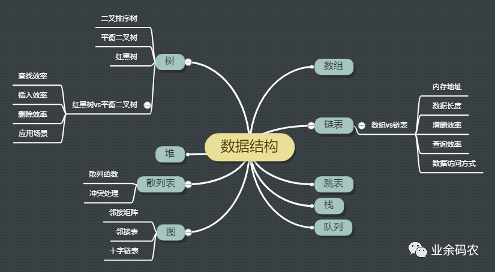
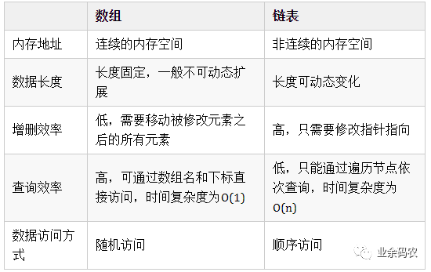
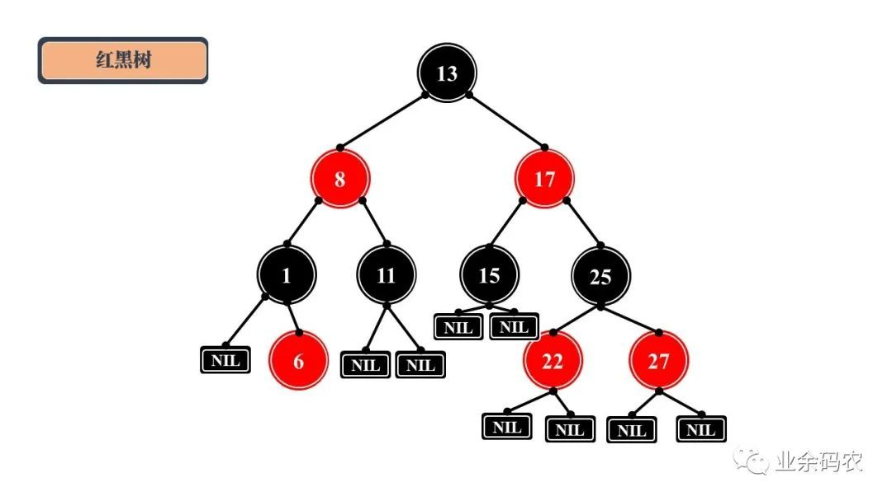
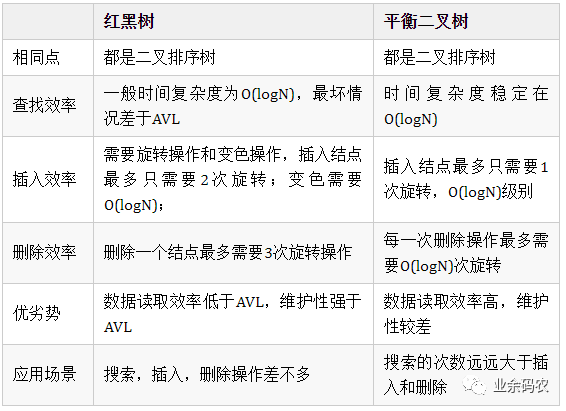

## 算法
### 常见的数据结构
常用的数据结构可根据数据访问的特点分为线性结构和非线性结构。线性结构包括常见的链表、栈、队列等，
非线性结构包括树、图等

#### 数组
数组中元素的存储是按照先后顺序进行的，同时在内存中也是按照这个顺序进行连续存放。数组相邻元素之间的
内存地址的间隔一般就是数组数据类型的大小。
#### 链表
链表相较于数组，除了数据域，还增加了指针域用于构建链式的存储数据。链表中每一个节点都包含此节点的数
据和指向下一节点地址的指针。
#### 链表和数组对比

#### 跳表
跳表的产生就是为了解决链表过长的问题，通过增加链表的多级索引来加快原始链表的查询效率。这样的方式可以
让查询的时间复杂度从O(n)提升至O(logn)。
#### 栈
栈是一种比较简单的数据结构，常用一句话描述其特性，后进先出。
#### 队列
队列是栈的兄弟结构，与栈的后进先出相对应，队列是一种先进先出的数据结构
#### 树
##### 平衡二叉树
平衡二叉树又被称为AVL树，它是一棵二叉排序树，且具有以下性质：它是一棵空树或它的左右两个子树的高度差的
绝对值不超过1，并且左右两个子树都是一棵平衡二叉树。
##### 红黑树
    1.每个结点要么是红的要么是黑的。
    2.根结点是黑的。
    3.每个叶结点（叶结点即指树尾端NIL指针或NULL结点）都是黑的。
    4.如果一个结点是红的，那么它的两个儿子都是黑的。
    5.对于任意结点而言，其到叶结点树尾端NIL指针的每条路径都包含相同数目的黑结点。

##### 红黑树VS平衡二叉树
    
 
#### 堆
了解完二叉树，再来理解堆就不是什么难事了。堆通常是一个可以被看做一棵树的数组对象。堆的具体实现一般不通过指针域，
而是通过构建一个一维数组与二叉树的父子结点进行对应，因此堆总是一颗完全二叉树。 

#### 散列表
散列表的实现原理正是映射的原理，通过设定的一个关键字和一个映射函数，就可以直接获得访问数据的地址，实现O(1)的数据
访问效率。在映射的过程中，事先设定的函数就是一个映射表，也可以称作散列函数或者哈希函数。
##### 一般常用的有以下几种散列函数：
直接寻址法：取关键字或关键字的某个线性函数值为散列地址。

数字分析法：通过对数据的分析，发现数据中冲突较少的部分，并构造散列地址。例如同学们的学号，通常同一届学生的学号，其
中前面的部分差别不太大，所以用后面的部分来构造散列地址。

平方取中法：当无法确定关键字里哪几位的分布相对比较均匀时，可以先求出关键字的平方值，然后按需要取平方值的中间几位作
为散列地址。这是因为：计算平方之后的中间几位和关键字中的每一位都相关，所以不同的关键字会以较高的概率产生不同的散列地址。

取随机数法：使用一个随机函数，取关键字的随机值作为散列地址，这种方式通常用于关键字长度不同的场合。

除留取余法：取关键字被某个不大于散列表的表长 n 的数 m 除后所得的余数 p 为散列地址。这种方式也可以在用过其他方法后再使用。
该函数对 m 的选择很重要，一般取素数或者直接用 n。

##### 常用的冲突处理方式
确定好散列函数之后，通过某个key值的确会得到一个唯一的value地址。但是却会出现一些特殊情况。即通过不同的key值可能会访
问到同一个地址，这个现象称之为冲突。

开放地址法（也叫开放寻址法）：实际上就是当需要存储值时，对Key哈希之后，发现这个地址已经有值了，这时该怎么办？不能放在这个地址，
不然之前的映射会被覆盖。这时对计算出来的地址进行一个探测再哈希，比如往后移动一个地址，如果没人占用，就用这个地址。如果超过最大长度，
则可以对总长度取余。这里移动的地址是产生冲突时的增列序量。

再哈希法：在产生冲突之后，使用关键字的其他部分继续计算地址，如果还是有冲突，则继续使用其他部分再计算地址。这种方式的缺点是时间增加了。

链地址法：链地址法其实就是对Key通过哈希之后落在同一个地址上的值，做一个链表。其实在很多高级语言的实现当中，也是使用这种方式处理冲突的。

公共溢出区：这种方式是建立一个公共溢出区，当地址存在冲突时，把新的地址放在公共溢出区里。

#### 图
图结构一般包括顶点和边，顶点通常用圆圈来表示，边就是这些圆圈之间的连线。边还可以根据顶点之间的关系设置不同的权重，
默认权重相同皆为1。此外根据边的方向性，还可将图分为有向图和无向图。
##### 邻接矩阵
目前常用的图存储方式为邻接矩阵，通过所有顶点的二维矩阵来存储两个顶点之间是否相连，或者存储两顶点间的边权重。

无向图的邻接矩阵是一个对称矩阵，是因为边不具有方向性，若能从此顶点能够到达彼顶点，那么彼顶点自然也能够达到此顶点。
此外，由于顶点本身与本身相连没有意义，所以在邻接矩阵中对角线上皆为0。

##### 邻接表
在邻接表中，图的每一个顶点都是一个链表的头节点，其后连接着该顶点能够直接达到的相邻顶点相。较于无向图，有向图的情况
更为复杂，因此这里采用有向图进行实例分析。

##### 逆邻接表
逆邻接表与邻接表结构类似，只不过图的顶点链接着能够到达该顶点的相邻顶点。也就是说，邻接表时顺着图中的箭头寻找相邻顶点，
而逆邻接表时逆着图中的箭头寻找相邻顶点。

参考链接：https://cloud.tencent.com/developer/article/1634155
### 五大常用算法总结
#### 1.穷举法
穷举法简单粗暴，没有什么问题是搞不定的，只要你肯花时间。同时对于小数据量，穷举法就是最优秀的算法。就像太祖长拳，简单，
人都能会，能解决问题，但是与真正的高手过招，就颓了。
#### 2.贪婪算法
贪婪算法可以获取到问题的局部最优解，不一定能获取到全局最优解，同时获取最优解的好坏要看贪婪策略的选择。
#### 3.动态规划算法
#### 4.分治算法
分治算法就是把一个大的问题分为若干个子问题，然后在子问题继续向下分，一直到base cases，通过base cases的解决，一步步向上，
最终解决最初的大问题。分治算法是递归的典型应用。
#### 5.回溯算法
回溯算法是深度优先策略的典型应用，回溯算法就是沿着一条路向下走，如果此路不同了，则回溯到上一个分岔路，在选一条路走，
一直这样递归下去，直到遍历万所有的路径。
    
    参考链接：https://blog.csdn.net/changyuanchn/article/details/51476281
### 10大排序算法
非线性时间比较类排序：通过比较来决定元素间的相对次序，由于其时间复杂度不能突破O(nlogn)，因此称为非线性时间比较类排序。
    
线性时间非比较类排序：不通过比较来决定元素间的相对次序，它可以突破基于比较排序的时间下界，以线性时间运行，因此称为线性时间非比较类排序。
 

    算法复杂度：　　
 
#### 1.冒泡排序
思路：外层循环从1到n-1，内循环从当前外层的元素的下一个位置开始，依次和外层的元素比较，出现逆序就交换，通过与相邻元素的比较和
交换来把小的数交换到最前面。
    
    $data = [23, 45, 8, 11, 10, 31, 55, 96, 30, 22];
     $len = count($data);
     
     for ($i = 0; $i < $len - 1; $i++) {
         for ($j = 0; $j < $len - $i - 1; $j++) {
             if ($data[$j + 1] < $data[$j]) {
                 $tmp = $data[$j + 1];
                 $data[$j + 1] = $data[$j];
                 $data[$j] = $tmp;
             }
         }
     }
     时间复杂度：最优o(n) 最差o(n*n)
     
#### 2.快速排序
    思路：通过一趟排序将待排记录分隔成独立的两部分，其中一部分记录的关键字均比另一部分
    的关键字小，则可分别对这两部分记录继续进行排序，以达到整个序列有序。
    function quick($originalData) {
         $lenght = count($originalData);
     
         if ($lenght <= 1) {
             return $originalData;
         }
         $pivot = threeMiddleValue($originalData, 0, $lenght - 1);
         $leftData = [];
         $rightData = [];
         for ($i = 0; $i < $lenght; $i++) {
             if ($originalData[$i] < $pivot) {
                 $leftData[] = $originalData[$i];
             } else if ($originalData[$i] > $pivot) {
                 $rightData[] = $originalData[$i];
             }
         }
         $leftData = quick($leftData);
         $rightData = quick($rightData);
         return array_merge($leftData, [$pivot], $rightData);
     }
     
     function threeMiddleValue($arr, $left, $right) {
         $result = null;
         $middle = floor(($left + $right) / 2);
         if ($arr[$left] > $arr[$right]) {
             if ($arr[$left] < $arr[$middle]) {
                 $result = $arr[$left];
             } else if ($arr[$right] > $arr[$middle]) {
                 $result = $arr[$right];
             } else {
                 $result = $arr[$middle];
             }
         } else {
             if ($arr[$right] < $arr[$middle]) {
                 $result = $arr[$right];
             } else if ($arr[$left] > $arr[$middle]) {
                 $result = $arr[$left];
             } else {
                 $result = $arr[$middle];
             }
         }
         return $result;
     }
     
     $testData = [7, 3, 10, 5, 1, 8];
     print_r(quick($testData));
#### 3.选择排序
    思路：冒泡排序是通过相邻的比较和交换，每次找个最小值。选择排序是：首先在未排序序列
    中找到最小（大）元素，存放到排序序列的起始位置，然后，再从剩余未排序元素中继续寻找
    最小（大）元素，然后放到已排序序列的末尾。以此类推，直到所有元素均排序完毕。
    $data = [12, 55, 99, 22, 33, 25, 11, 44, 78];
     $len = count($data);
     for ($i = 0; $i < $len - 1; $i++) {
         $tmp = $data[$i];
         $tmpKey = $i;
         for ($j = $i; $j < $len; $j++) {
             if ($tmp > $data[$j]) {
                 $tmp = $data[$j];
                 $tmpKey = $j;
             }
         }
     
         if ($tmpKey != $i) {
             $data[$tmpKey] = $data[$i];
             $data[$i] = $tmp;
         }
     }
#### 4.堆排序
    思路：堆积是一个近似完全二叉树的结构，并同时满足堆积的性质：即子结点的键值或索引
    总是小于（或者大于）它的父节点。
#### 5.插入排序
    思路：通过构建有序序列，对于未排序数据，在已排序序列中从后向前扫描，找到相应位置
    并插入。可以理解为玩扑克牌时的理牌；
    $data = [155, 19, 88, 12, 40, 29, 1, 23];
     $len = count($data);
     
     for ($i = 0; $i < $len; $i++) {
         for ($j = $i; $j > 0; $j--) {
             if ($data[$j - 1] > $data[$j]) {
                 $tem = $data[$j - 1];
                 $data[$j - 1] = $data[$j];
                 $data[$j] = $tem;
             }else{
                 break;
             }
         }
     }
     print_r($data);
     
### 7大查找算法
#### 1.二分查找
#### 2.折半查找

### 二叉树
    前序：根结点 ---> 左子树 ---> 右子树
    中序：左子树---> 根结点 ---> 右子树
    后序：左子树 ---> 右子树 ---> 根结点
    层次遍历：按层次排序
    深度优先：
    广度优先：
### b树(B-树)
### b+树