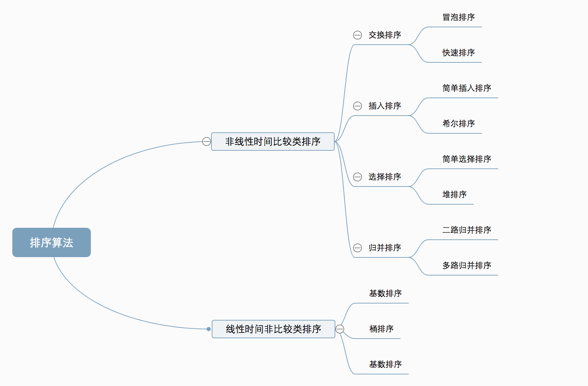

## 算法
### 常见的数据结构
#### 数组
#### 链表
#### 集合
#### 队列
#### 图
#### 树
### 五大常用算法总结
    1.穷举法
    穷举法简单粗暴，没有什么问题是搞不定的，只要你肯花时间。同时对于小数据量，
    穷举法就是最优秀的算法。就像太祖长拳，简单，人人都能会，能解决问题，但是
    与真正的高手过招，就颓了。
    2.贪婪算法
    贪婪算法可以获取到问题的局部最优解，不一定能获取到全局最优解，同时获取最
    优解的好坏要看贪婪策略的选择。
    3.动态规划算法
    4.分治算法
    分治算法就是把一个大的问题分为若干个子问题，然后在子问题继续向下分，一直到
    base cases，通过base cases的解决，一步步向上，最终解决最初的大问题。分治算
    法是递归的典型应用。
    5.回溯算法
    回溯算法是深度优先策略的典型应用，回溯算法就是沿着一条路向下走，如果此路不同了，
    则回溯到上一个分岔路，在选一条路走，一直这样递归下去，直到遍历万所有的路径。
    
    参考链接：https://blog.csdn.net/changyuanchn/article/details/51476281
### 10大排序算法
    非线性时间比较类排序：通过比较来决定元素间的相对次序，由于其时间复杂度不能突破
    O(nlogn)，因此称为非线性时间比较类排序。
    线性时间非比较类排序：不通过比较来决定元素间的相对次序，它可以突破基于比较排序
    的时间下界，以线性时间运行，因此称为线性时间非比较类排序。
 

    算法复杂度：　　
 
#### 1.冒泡排序
    思路：外层循环从1到n-1，内循环从当前外层的元素的下一个位置开始，依次和外层的元素
    比较，出现逆序就交换，通过与相邻元素的比较和交换来把小的数交换到最前面。
    $data = [23, 45, 8, 11, 10, 31, 55, 96, 30, 22];
     $len = count($data);
     
     for ($i = 0; $i < $len - 1; $i++) {
         for ($j = 0; $j < $len - $i - 1; $j++) {
             if ($data[$j + 1] < $data[$j]) {
                 $tmp = $data[$j + 1];
                 $data[$j + 1] = $data[$j];
                 $data[$j] = $tmp;
             }
         }
     }
     时间复杂度：最优o(n) 最差o(n*n)
     
#### 2.快速排序
    思路：通过一趟排序将待排记录分隔成独立的两部分，其中一部分记录的关键字均比另一部分
    的关键字小，则可分别对这两部分记录继续进行排序，以达到整个序列有序。
    function quick($originalData) {
         $lenght = count($originalData);
     
         if ($lenght <= 1) {
             return $originalData;
         }
         $pivot = threeMiddleValue($originalData, 0, $lenght - 1);
         $leftData = [];
         $rightData = [];
         for ($i = 0; $i < $lenght; $i++) {
             if ($originalData[$i] < $pivot) {
                 $leftData[] = $originalData[$i];
             } else if ($originalData[$i] > $pivot) {
                 $rightData[] = $originalData[$i];
             }
         }
         $leftData = quick($leftData);
         $rightData = quick($rightData);
         return array_merge($leftData, [$pivot], $rightData);
     }
     
     function threeMiddleValue($arr, $left, $right) {
         $result = null;
         $middle = floor(($left + $right) / 2);
         if ($arr[$left] > $arr[$right]) {
             if ($arr[$left] < $arr[$middle]) {
                 $result = $arr[$left];
             } else if ($arr[$right] > $arr[$middle]) {
                 $result = $arr[$right];
             } else {
                 $result = $arr[$middle];
             }
         } else {
             if ($arr[$right] < $arr[$middle]) {
                 $result = $arr[$right];
             } else if ($arr[$left] > $arr[$middle]) {
                 $result = $arr[$left];
             } else {
                 $result = $arr[$middle];
             }
         }
         return $result;
     }
     
     $testData = [7, 3, 10, 5, 1, 8];
     print_r(quick($testData));
#### 3.选择排序
    思路：冒泡排序是通过相邻的比较和交换，每次找个最小值。选择排序是：首先在未排序序列
    中找到最小（大）元素，存放到排序序列的起始位置，然后，再从剩余未排序元素中继续寻找
    最小（大）元素，然后放到已排序序列的末尾。以此类推，直到所有元素均排序完毕。
    $data = [12, 55, 99, 22, 33, 25, 11, 44, 78];
     $len = count($data);
     for ($i = 0; $i < $len - 1; $i++) {
         $tmp = $data[$i];
         $tmpKey = $i;
         for ($j = $i; $j < $len; $j++) {
             if ($tmp > $data[$j]) {
                 $tmp = $data[$j];
                 $tmpKey = $j;
             }
         }
     
         if ($tmpKey != $i) {
             $data[$tmpKey] = $data[$i];
             $data[$i] = $tmp;
         }
     }
#### 4.堆排序
    思路：堆积是一个近似完全二叉树的结构，并同时满足堆积的性质：即子结点的键值或索引
    总是小于（或者大于）它的父节点。
#### 5.插入排序
    思路：通过构建有序序列，对于未排序数据，在已排序序列中从后向前扫描，找到相应位置
    并插入。可以理解为玩扑克牌时的理牌；
    $data = [155, 19, 88, 12, 40, 29, 1, 23];
     $len = count($data);
     
     for ($i = 0; $i < $len; $i++) {
         for ($j = $i; $j > 0; $j--) {
             if ($data[$j - 1] > $data[$j]) {
                 $tem = $data[$j - 1];
                 $data[$j - 1] = $data[$j];
                 $data[$j] = $tem;
             }else{
                 break;
             }
         }
     }
     print_r($data);
     
### 7大查找算法
#### 1.二分查找
#### 2.折半查找

### 二叉树
    前序：根结点 ---> 左子树 ---> 右子树
    中序：左子树---> 根结点 ---> 右子树
    后序：左子树 ---> 右子树 ---> 根结点
    层次遍历：按层次排序
    深度优先：
    广度优先：
### b树(B-树)
### b+树