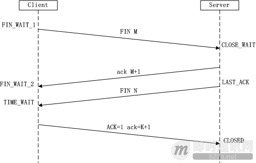

## 网络
###  同步，异步，阻塞，非阻塞
    同步：就是在发出一个功能调用时，在没有得到结果之前，该调用就不返回。
    异步：和同步相对。当一个异步过程调用发出后，调用者不能立刻得到结果。
    实际处理这个调用的部件在完成后，通过状态、通知和回调来通知调用者
    阻塞：意思就是在哪里等待，要等别人执行完成才能往下去执行； 
    非阻塞：就是程序可以不用等待执行的结果， 就可以进行下一步的操作；
### 进程，线程，协成
    进程：进程，直观点说，保存在硬盘上的程序运行以后，会在内存空间里形成一个独立的内存体，
    这个内存体有自己独立的地址空间，有自己的堆，上级挂靠单位是操作系统。操作系统会以进程为单位，
    分配系统资源（CPU时间片、内存等资源），进程是资源分配的最小单位
    线程：有时被称为轻量级进程(Lightweight Process，LWP），是操作系统调度
    （CPU调度）执行的最小单位
    协程：是一种比线程更加轻量级的存在，协程不是被操作系统内核所管理，而完全是由程序所控制
    （也就是在用户态执行）。这样带来的好处就是性能得到了很大的提升，不会像线程切换那样消耗资源
### 三次握手
    所谓三次握手（Three-Way Handshake）即建立TCP连接，就是指建立一个
    TCP连接时，需要客户端和服务端总共发送3个包以确认连接的建立。在s
    ocket编程中，这一过程由客户端执行connect来触发，整个流程如下图所示：
   
  
    
    （1）第一次握手：
    Client将标志位SYN置为1，随机产生一个值seq=J，并将该数据包发送给Server，
    Client进入SYN_SENT状态，等待Server确认。
    （2）第二次握手：
    Server收到数据包后由标志位SYN=1知道Client请求建立连接，Server将标志
    位SYN和ACK都置为1，ack=J+1，随机产生一个值seq=K，并将该数据包发送给
    Client以确认连接请求，Server进入SYN_RCVD状态。
    （3）第三次握手：
    Client收到确认后，检查ack是否为J+1，ACK是否为1，如果正确则将标志位
    ACK置为1，ack=K+1，并将该数据包发送给Server，Server检查ack是否为K+1，
    ACK是否为1，如果正确则连接建立成功，Client和Server进入ESTABLISHED状态，
    完成三次握手，随后Client与Server之间可以开始传输数据了。
    
    为什么要3次握手
    防止已过期的连接请求报文突然又传送到服务器，因而产生错误。
### 四次挥手 
    所谓四次挥手（Four-Way Wavehand）即终止TCP连接，就是指断开一个TCP连接时，
    需要客户端和服务端总共发送4个包以确认连接的断开。在socket编程中，这一过
    程由客户端或服务端任一方执行close来触发，整个流程如下图所示：  

     
    
    第一次挥手：
    Client发送一个FIN，用来关闭Client到Server的数据传送，Client进入FIN_WAIT_1状态。
    第二次挥手：
    Server收到FIN后，发送一个ACK给Client，确认序号为收到序号+1
    （与SYN相同，一个FIN占用一个序号），Server进入CLOSE_WAIT状态。
    第三次挥手：
    Server发送一个FIN，用来关闭Server到Client的数据传送，
    Server进入LAST_ACK状态。
    第四次挥手：
    Client收到FIN后，Client进入TIME_WAIT状态，接着发送一个ACK给Server，
    确认序号为收到序号+1，Server进入CLOSED状态，完成四次挥手
    
    	先由客户端向服务器端发送一个FIN，请求关闭数据传输。
	当服务器接收到客户端的FIN时，向客户端发送一个ACK，其中ack的值等于FIN+SEQ
	然后服务器向客户端发送一个FIN，告诉客户端应用程序关闭。
	当客户端收到服务器端的FIN是，回复一个ACK给服务器端。其中ack的值等于FIN+SEQ
    	为什么要4次挥手？
    	确保数据能够完成传输。

	https://www.cnblogs.com/saolv/p/7807677.html
	
### 五大io模型
    阻塞IO：
    非阻塞IO：
    信号驱动IO：
    IO多路转接：
    异步IO：
### 网络模型
    select，poll，epoll本质上都是同步I/O，因为他们都需要在读写事件就绪后自己负责进行读写，
    也就是说这个读写过程是阻塞的
    https://www.jianshu.com/p/397449cadc9a
    select 
    poll 
    epoll 
    reactor模型
        Reactor模式是处理并发I/O比较常见的一种模式，用于同步I/O，中心思想是将所有
        要处理的I/O事件注册到一个中心I/O多路复用器上，同时主线程/进程阻塞在多路复用器上；
        一旦有I/O事件到来或是准备就绪(文件描述符或socket可读、写)，多路复用器返回并将
        事先注册的相应I/O事件分发到对应的处理器中。
        Reactor是一种事件驱动机制，和普通函数调用的不同之处在于：应用程序不是主动的调用
        某个API完成处理，而是恰恰相反，Reactor逆置了事件处理流程，应用程序需要提供相应
        的接口并注册到Reactor上，如果相应的事件发生，Reactor将主动调用应用程序注册的接
        口，这些接口又称为“回调函数”。用“好莱坞原则”来形容Reactor再合适不过了：不要打电
        话给我们，我们会打电话通知你。
        Reactor模式与Observer模式在某些方面极为相似：当一个主体发生改变时，所有依属体
        都得到通知。不过，观察者模式与单个事件源关联，而反应器模式则与多个事件源关联 。
### 进程间通讯的方式(https://www.cnblogs.com/zgq0/p/8780893.html)
	1.管道：速度慢，容量有限，只有父子进程能通讯    
	2.FIFO：任何进程间都能通讯，但速度慢    
	3.消息队列：容量受到系统限制，且要注意第一次读的时候，要考虑上一次没有读完数据的问题    
	4.信号量：不能传递复杂消息，只能用来同步    
	5.共享内存区：能够很容易控制容量，速度快，但要保持同步，比如一个进程在写的时候，另一个进程要注意读写的问题，相当于线程中的线程安全，当然，共享内存区同样可以用作线程间通讯，不过没这个必要，线程间本来就已经共享了同一进程内的一块内存
### http常见状态码
    301 moved permanently 永久重定向，将用户的访问，重定向到某个url，
    当访问忘记最后加/,将301
    302 found 临时重定向，书签不会变更
    303 see other 临时重定向，希望get方法访问
    304 Not Modified（未修改）客户的缓存资源是最新的，要客户端使用缓存
    400 bad request 请求中有错误语法
    403 forbidden 访问被服务器拒绝，包括文件权限，防火墙等等
    404 not found 没有找到要访问资源
    408 Request Timeout（请求超时）如果客户端完成请求时花费的时间太长， 
    服务器可以回送这个状态码并关闭连接
    409 Conflict（冲突）发出的请求在资源上造成了一些冲突
    407 Proxy Authentication Required(要求进行代理认证) 与状态码401类似， 
    用于需要进行认证的代理服务器
    500 internel erver error 服务端执行请求时发生错误，可能web应用端存在bug
    502 Bad Gateway（网关故障）
    		1.代理使用的服务器遇到了上游的无效响应
    		2.若代理服务器+真实服务器，大部分情况下是真实服务器返回的请求失败，
    		代理服务器才返回502
    503 service unavailable 服务器暂时属于超负载或者正在停机维护，无法处理请求。
    504 Gateway Time-out PHP-CGI已经执行，但是由于某种原因(一般是读取资源的问题)
    没有执行完毕而导致PHP-CGI进程终止。
### 常用的信号量
    SIGKILL 9 终止进程 杀死进程/关闭进程（暴力关闭）
    SIGUSR1 10 终止进程 用户定义信号1 
    
## 并发
### rps,qps,tps,pv,uv,吞吐量
    rps:代表吞吐率，即 Requests Per Second 的缩写。 
    吞吐率是服务器并发处理能力的量化描述，
    单位是 reqs/s，指的是某个并发用户数下单位时间内处理的请求数。
        并发数/平均响应时间
    tps：每秒查询数，每秒系统能够处理的查询请求次数
    qps: 每秒请求数
        qps>1000可以称为高并发，一般的也就2,300左右也算ok的
        常用的压测工具ab,jmeter
        注：不要对线上数据进行压测
    pv:问量,即页面浏览量或者点击量,用户每次对网站的访问均被记录1次。
    用户对同一页面的多次访问，访问量值累计
    uv:独立访客，将每个独立上网电脑（以cookie为依据）视为一位访客，
    一天之内（00:00-24:00），访问您网站的访客数量。一天之内相同
    cookie的访问只被计算1次
        常键pv,uv检测：
            1.第三方(百度)
            2.nginx访问日志
    吞吐量：单位时间内处理的任务数
    https://www.huaweicloud.com/articles/e69c2d94805734d47a5b86d4f70b7d3b.html