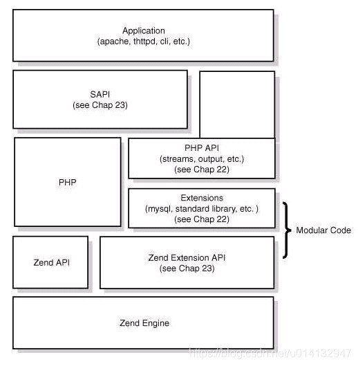
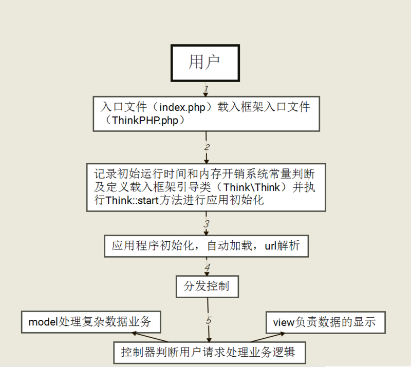

## php基础
### 底层原理
#### PHP一次请求的生命周期
    第一阶段：SAPI接口,模块初始化阶段
    第二阶段：请求初始化阶段
    第三阶段：php脚本执行阶段
    第四阶段：请求结束阶段
    参考链接：https://segmentfault.com/a/1190000014220536
              http://www.noobyard.com/article/p-haihkowd-vn.html
#### PHP语言的整体架构图(包括其核心的组成模块即可)

   

    Application: 程序员编写的 PHP 程序，无论是 Web 应用还是 Cli 方式运行的应用都是上层应用，
    PHP 程序员主要工作就是编写它们。 
    
    SAPI:SAPI 是 Server Application Programming Interface 的缩写，中文为服务端应用编程接口，
    它通过一系列钩子函数使得 PHP 可以和外 围交换数据，SAPI 就是 PHP 和外部环境的代理器，
    它把外部环境抽象后，为内部的 PHP 提供一套固定的，统一的接口，使得 PHP 自身实现能够
    不受错综 复杂的外部环境影响，保持一定的独立性。 通过 SAPI 的解耦，PHP 可以不再考虑如
    何针对不同应用进行兼容，而应用本身也可以针对自己的特点实现不同的处理方式。 
    
    Extensions 扩展：常见的内置函数、标准库都是通过 extension 来实现的，这些叫做 PHP 的核心扩展，
    用户也可以根据自己的要求安装 PHP 的扩展 
    
    Zend 引擎:Zend 引擎是 PHP4 以后加入 PHP 的，是对原有 PHP 解释器的重写，整体使用 C 语言进行开发，
    也就是说可以把 PHP 理解成用 C 写的 一个编程语言软件，引擎的作用是将 PHP 代码翻译为一种叫 
    opcode 的中间语言，它类似于 JAVA 的 ByteCode（字节码）。 引擎对 PHP 代码会执行四个: 
    	1. 词法分析 Scanning（Lexing），将 PHP 代码转换为语言片段（Tokens）。 
    	2. 解析 Parsing， 将 Tokens 转换成简单而有意义的表达式。 
    	3. 编译 Compilation，将表达式编译成 Opcode。 
    	4. 执行 Execution，顺序执行 Opcode，每次一条，以实现 PHP 代码所表达的功能 
    	APC、Opchche 这些扩展可以将 Opcode 缓存以加速 PHP 应用的运行速度，
    使用它们就可以在请求再次来临时省略前三步。 
    引擎也实现了基本的数据结构、内存分配及管理，提供了相应的 API 方法供外部调用。
    
#### PHP的垃圾回收集机制

    引擎在判断一个变量空间是否能够被释放的时候是依据这个变量的zval的refcount的值，
    如果refcount为0，那么变量的空间可以被释放，否则就不释放，这是一种非常简单的GC实现
    参考链接：https://cloud.tencent.com/developer/article/1723827
#### CgI、php-cgi、 Fastcgi、 php-fpm 几者的关系
    CGI:(Common Gateway Interface)通用网关接口
        HTTP服务器与你的或其它机器上的程序进行“交谈”的一种工具，
        其程序须运行在网络服务器上只要激活后，每次都要花费时间去fork一次
        缺点：每个请求一个新进程，进程间通信地址空间无法共享，
        限制了数据库连接、内存缓存等资源的重用。
    FastCGI:(Fast Common Gateway Interfac)快速通用网关接口
        FastCGI像是一个常驻(long-live)型的CGI，它可以一直执行着，只要激活后，
        不会每次都要花费时间去fork一次（这是CGI最为人诟病的fork-and-execute 模式）。
        它还支持分布式的运算，即 FastCGI 程序可以在网站服务器以外的主机上执行并
        且接受来自其它网站服务器来的请求。
	PHP-CGI是PHP自带的FastCGI管理器	
        PHP-CGI的不足：
        1.php-cgi变更php.ini配置后需重启php-cgi才能让新的php-ini生效，不可以平滑重启。
        2.直接杀死php-cgi进程，php就不能运行了。(PHP-FPM和Spawn-FCGI就没有这个问题，
        守护进程会平滑从新生成新的子进程。）
	PHP-FPM:(PHP-FastCGI Process Manager)
	    PHP专门的快速通用网关接口进程管理	
	    PHP-FPM是一个PHP FastCGI管理器，其实是PHP源代码的一个补丁   
	参考链接：https://www.biaodianfu.com/cgi-fastcgi-wsgi.html
#### fastCGI,Nginx之间是什么关系
    FastCGI 是一个协议，它是应用程序和 WEB 服务器连接的桥梁。
    Nginx 并不能直接与 PHP-FPM 通信，而是将请求通过 FastCGI 
    交给 PHP-FPM 处理。
    参考链接：
    https://www.cnblogs.com/liyuanhong/articles/11181537.html
    https://www.cnblogs.com/jianzhaojing/p/13623509.html
#### php五种运行模式
    
    1.CGI（通用网关接口/ Common Gateway Interface）
    2.FastCGI（常驻型CGI / Long-Live CGI）
    3.CLI（命令行运行 / Command Line Interface）
    4.Web模块模式（Apache等Web服务器运行的模式） 
    5.ISAPI（Internet Server Application Program Interface）
#### nginx如何调用PHP(nginx+php运行原理)
    1、nginx的worker进程直接管理每一个请求到nginx的网络请求。
    2、对于php而言，由于在整个网络请求的过程中php是一个cgi程序的角色，所以采用名为php-fpm的进程管理
    程序来对这些被请求的php程序进行管理。php-fpm程序也如同nginx一样，需要监听端口，并且有master和
    worker进程。worker进程直接管理每一个php进程。
    3、关于fastcgi：fastcgi是一种进程管理器，管理cgi进程。市面上有多种实现了fastcgi功能的进程管理器，
    php-fpm就是其中的一种。再提一点，php-fpm作为一种fast-cgi进程管理服务，会监听端口，一般默认监
    听9000端口，并且是监听本机，也就是只接收来自本机的
    端口请求，所以我们通常输入命令 netstat -nlpt|grep php-fpm 会得到：
    1   tcp 0  0 127.0.0.1:9000   0.0.0.0:*    LISTEN    1057/php-fpm
    这里的127.0.0.1:9000 就是监听本机9000端口的意思。
    4、关于fastcgi的配置文件，目前fastcgi的配置文件一般放在nginx.conf同级目录下，配置文件形式，
    一般有两种：fastcgi.conf  和 fastcgi_params。不同的nginx版本会有不同的配置文件，这两个配置文
    件有一个非常重要的区别：fastcgi_parames文件中缺少下列配置：
    fastcgi_param  SCRIPT_FILENAME    $document_root$fastcgi_script_name;
    我们可以打开fastcgi_parames文件加上上述行，也可以在要使用配置的地方动态添加。使得该配置生效。
    5、当需要处理php请求时，nginx的worker进程会将请求移交给php-fpm的worker进程进行处理，也就是最
    开头所说的nginx调用了php，其实严格得讲是nginx间接调用php。
#### 从浏览器输入URL到页面解析的全过程
    1.输入网址
    输入要访问的网址，即URL
    2.缓存解析
    浏览器获取URL后，先去缓存中查找资源，从浏览器缓存-系统缓存-路由器缓存中查看；
    如果有就从缓存中显示界面，不再发送请求；
    如果没有，则发送http请求；
    3.域名解析
    发现缓存中没有资源，发送http请求；
    在发送http请求之前，需要进行DNS解析(域名解析)；
    DNS解析：域名到IP地址的转换过程，域名的解析工作由DNS服务器完成，解析后可以获取域名相应的IP地址；
    4.tcp连接，三次握手
    在域名解析后，浏览器向服务器发起了http请求，tcp连接；
    因为tcp协议时面向连接的，所以在传输数据前必须建立连接，即三次握手；
    tcp连接建立后，浏览器开始向服务器发送http请求，请求数据包。请求信息包含一个头部和一个请求体；
    5.服务器收到请求
    服务器收到浏览器发送的请求信息，返回一个响应头和一个响应体。
    6.页面渲染
    浏览器收到服务器发送的响应头和响应体，进行客户端渲染,生成Dom树，解析css样式,js交互。
    参考地址：https://www.geek-share.com/detail/2796178796.html
### 常见函数
    array_pop() 删除数组的最后一个元素（出栈）。
    array_push() 将一个或多个元素插入数组的末尾（入栈）。
    array_shift() 删除数组中首个元素，并返回被删除元素的值。
    array_unshift() 在数组开头插入一个或多个元素。
    stripos() 返回字符串在另一字符串中第一次出现的位置（对大小写不敏感）。
    strpos() 返回字符串在另一字符串中第一次出现的位置（对大小写敏感）。
    strripos() 查找字符串在另一字符串中最后一次出现的位置（对大小写不敏感）。
    strrpos() 查找字符串在另一字符串中最后一次出现的位置（对大小写敏感）。
### PHP7与PHP5区别
    1、性能提升：PHP7比PHP5.0性能提升了两倍。
    2、以前的许多致命错误，现在改成抛出异常。
    3、PHP 7.0比PHP5.0移除了一些老的不在支持的SAPI（服务器端应用编程端口）和扩展。
    4、PHP 7.0比PHP5.0新增了空接合操作符。
    5、PHP 7.0比PHP5.0新增加了结合比较运算符。
    6、PHP 7.0比PHP5.0新增加了函数的返回类型声明。
    7、PHP 7.0比PHP5.0新增加了标量类型声明。
    8、PHP 7.0比PHP5.0新增加匿名类。
### 为什么 PHP7 比 PHP5 性能提升了？
    1、变量存储字节减小，减少内存占用，提升变量操作速度
    2、改善数组结构，数组元素和hash映射表被分配在同一块内
    存里，降低了内存占用、提升了 cpu 缓存命中率
    3、改进了函数的调用机制，通过优化参数传递的环节，减少了一些指令，提高执行效率
### 面向对象
#### 面向对象三大特性
    1. 封装
    封装，就是将客观事物抽象为逻辑实体，实体的属性和功能相结合，形成一个有机的整体。
    并对实体的属性和功能实现进行访问控制，向信任的实体开放，对不信任的实体隐藏。
    通过开放的外部接口即可访问，无需知道功能如何实现。
    封装主要有以下目的：
    1)可隐藏实体实现的细节。
    2)提高安全性，设定访问控制，只允许具有特定权限的使用者调用。
    3)简化编程，调用方无需知道功能是怎么实现的，即可调用。
    2. 继承
    3. 多态
    多态，是指一个类的同名方法，在不同情况下的实现细节不同。
    多态机制实现不同的内部实现结构共用同一个外部接口。
    多态有以下目的：
        1.一个外部接口可被多个同类使用。
        2.不同对象调用同个方法，可有不同实现。
    实现多态二种方式： 
        1.覆盖，是指子类重新定义父类的虚函数的做法。 
        2.重载，是指允许存在多个同名函数，而这些函数的参数表不同
        （或许参数个数不同，或许参数类型不同，或许两者都不同）
    参考链接：
    https://segmentfault.com/a/1190000021898422
    https://www.huaweicloud.com/articles/12538958.html
#### 面向对象的五大基本原则
    1.单一职责原则（SRP）
    2.开放封闭原则（OCP）
    3.里氏替换原则（LSP)
    4.依赖倒置原则（DIP)
    5.接口隔离原则   
#### 抽象类，接口的区别
### 关键的字
#### 1.trait关键字用处
    Traits 是一种为类似 PHP 的单继承语言而准备的代码复用机制。
    Trait 为了减少单继承语言的限制，使开发人员能够自由地在不同
    层次结构内独立的类中复用方法集
    解决php的单继承问题
#### 2.static关键字的作用，跟其他的属性有什么区别
#### 2.private,protected,public的区别
    > private只能在当前类中调用
    > protected能在当前类中调用也能在子类中调用
    > public可以到所有类中
### 正则使用
    1.用户邮箱
    "/^[a-zA-Z0-9-]+@[a-zA-Z0-9-]+(.[a-zA-Z0-9_-]+)+$/"; 
    2.手机号
    "/^1(3|4|5|6|7|8|9)\d{9}$/"; 
    
 [参考链接：https://note.youdao.com](https://note.youdao.com/web/#/file/WEBd9fc02df9ec171264d86a28097fb9c6d/note/WEBfc04a8cadd692426e6b7e6357900ec17/)
### 常见问题
### 4.依赖注入/控制反转的原理与作用  
    原理：
    作用：1.减少系统的耦合度
          2.减少系统类的创建
### 5.自动加载原理
    https://segmentfault.com/a/1190000014948542
    1.启动
    <?php
      define('LARAVEL_START', microtime(true));
    
      require __DIR__ . '/../vendor/autoload.php';
      
    去 vendor 目录下的 autoload.php ：
    <?php
      require_once __DIR__ . '/composer' . '/autoload_real.php';
    
      return ComposerAutoloaderInit7b790917ce8899df9af8ed53631a1c29::getLoader();
      
    2.Composer自动加载文件
    3.autoload_real 引导类
        第一部分——单例
        第二部分——构造ClassLoader核心类
        第三部分 —— 初始化核心类对象
            autoload_static 静态初始化 ( PHP >= 5.6 )
            classMap（命名空间映射）
            ClassLoader 接口初始化（ PHP < 5.6 ）
            命名空间映射
        第四部分 —— 注册
            全局函数的自动加载
            静态初始化：
            普通初始化
            加载全局函数
        第五部分 —— 运行
        
    我们通过举例来说下上面代码的流程：
    如果我们在代码中写下 new phpDocumentor\Reflection\Element()，PHP 会通过
     SPL_autoload_register 调用 loadClass -> findFile -> findFileWithExtension。
     步骤如下：
    将 \ 转为文件分隔符/，加上后缀php，变成 $logicalPathPsr4, 
    即 phpDocumentor/Reflection//Element.php;
    利用命名空间第一个字母p作为前缀索引搜索 prefixLengthsPsr4 数组，查到下面这个数组：
            p' => 
                array (
                    'phpDocumentor\\Reflection\\' => 25,
                    'phpDocumentor\\Fake\\' => 19,
              )
    遍历这个数组，得到两个顶层命名空间 phpDocumentor\Reflection\ 和 phpDocumentor\Fake\
    在这个数组中查找 phpDocumentor\Reflection\Element，找出 phpDocumentor\Reflection\ 
    这个顶层命名空间并且长度为25。在prefixDirsPsr4 映射数组中得到phpDocumentor\Reflection\ 
    的目录映射为：
        'phpDocumentor\\Reflection\\' => 
            array (
                0 => __DIR__ . '/..' . '/phpdocumentor/reflection-common/src',
                1 => __DIR__ . '/..' . '/phpdocumentor/type-resolver/src',
                2 => __DIR__ . '/..' . '/phpdocumentor/reflection-docblock/src',
            ),
    遍历这个映射数组，得到三个目录映射；
    查看 “目录+文件分隔符//+substr(&dollar;logicalPathPsr4, &dollar;length)”文件是否存在，
    存在即返回。这里就是'__DIR__/../phpdocumentor/reflection-common/src + substr(phpDocumentor
    /Reflection/Element.php,25)'如果失败，则利用 fallbackDirsPsr4 数组里面的目录继续判断
    是否存在文件以上就是 composer 自动加载的原理解析！
    
## php框架
### Laravel
#### Laravel生命周期
    1、Laravel 采用了单一入口模式，应用的所有请求入口都是 public/index.php 文件。
    2、注册类文件自动加载器 : Laravel通过 composer 进行依赖管理，无需开发者手动导入各种类文件，、
    而由自动加载器自行导入。
    3、创建服务容器：从 bootstrap/app.php 文件中取得 Laravel 应用实例 $app (服务容器)
    创建 HTTP / Console 内核：传入的请求会被发送给 HTTP 内核或者 console 内核进行处理
    4、载入服务提供者至容器：在内核引导启动的过程中最重要的动作之一就是载入服务提供者到
    你的应用，服务提供者负责引导启动框架的全部各种组件，例如数据库、队列、验证器以及路由组件。
    5、分发请求：一旦应用完成引导和所有服务提供者都注册完成，Request 将会移交给路由进行
    分发。路由将分发请求给一个路由或控制器，同时运行路由指定的中间件
   
#### Laravel关键特性
    1.路由
    2.计划任务
    3.队列
    4.脚手架
    5.控制反转，依赖注入
#### Laravel中间件实现原理
    https://learnku.com/articles/5463/laravel-middleware-implementation-principle
#### Laravel artisan实现原理   
    https://learnku.com/articles/52949
### Yii2生命周期
    1.用户向入口脚本 web/index.php 发起请求。
    2.入口脚本加载应用配置并创建一个应用 实例去处理请求。
    3.应用通过请求组件解析请求的 路由。
    4.应用创建一个控制器实例去处理请求。
    5.控制器创建一个动作实例并针对操作执行过滤器。
    6.如果任何一个过滤器返回失败，则动作取消。
    7.如果所有过滤器都通过，动作将被执行。
    8.动作会加载一个数据模型，或许是来自数据库。
    9.动作会渲染一个视图，把数据模型提供给它。
    10.渲染结果返回给响应组件。
    11.响应组件发送渲染结果给用户浏览器。
 

### ThinkPHP生命周期
  

### 浅谈laravel框架与thinkPHP框架的区别
    1、渲染模版方式的不同:
    在Laravel框架里,使用return view()来渲染模版;
    而ThinkPHP里则使用了$this- display()的方式渲染模版;
    2、在Laravel框架里,由于其考虑到了跨站请求伪造, 所以如果使用form表单以post方式进行传值时,
    如果不再form表单中加入{{csrf_field()}}则会报出TokenMethodnotfound的语法错误;
    而TP框架则需要自己手动完成防止跨站攻击的代码;
    3、Laravel是一个重路由的框架(5.4),所有的功能都是由路由发起的,哪怕没有控制器方法,只要写了
    路由就能够访问,thinkPHP(3.2),必须要有控制器方法才能正常访问;
    4、laravel具有强大的社区化扩展，（composer扩展自动加载）;
    5、laravel具有强大的Blade模版引擎;
    6、中间件，Laravel特点，可以实现访问前后的处理，例如请求和返回，权限认证等;
    7、条件判断语句书写方式的差异:
    Laravel框架里 if else判断语句和foreach语句 书写时必须以@if开头 以@endif结尾,如果没有则报
    语法错误,@foreach @endforeach同理;
    而TP框架则和PHP语法规则使用方式一致直接ifesle语句判断和foreach循环遍历
    参考链接：https://cloud.tencent.com/developer/article/1723045
