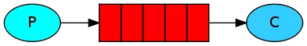
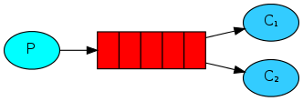
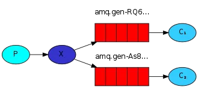
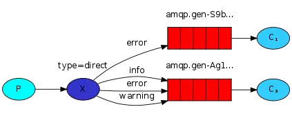
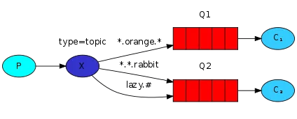
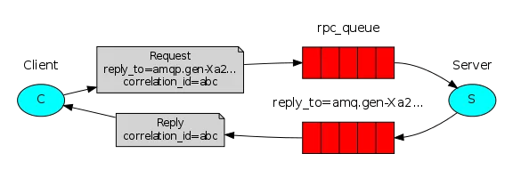

## rabbimq
### 七种模式介绍与应用场景
##### 简单模式（Hello World）

    
做最简单的事情，一个生产者对应一个消费者，RabbitMQ相当于一个消息代理，负责将A的消息转发给B

应用场景：将发送的电子邮件放到消息队列，然后邮件服务在队列中获取邮件并发送给收件人

##### 工作队列模式（Work queues）

在多个消费者之间分配任务（竞争的消费者模式），一个生产者对应多个消费者，一般适用于执行资
源密集型任务，单个消费者处理不过来，需要多个消费者进行处理

应用场景：一个订单的处理需要10s，有多个订单可以同时放到消息队列，然后让多个消费者同时处理，
这样就是并行了，而不是单个消费者的串行情况

##### 订阅模式（Publish/Subscribe）

一次向许多消费者发送消息，一个生产者发送的消息会被多个消费者获取，也就是将消息将广播到所有的消费者中。

应用场景：更新商品库存后需要通知多个缓存和多个数据库，这里的结构应该是：

    一个fanout类型交换机扇出两个个消息队列，分别为缓存消息队列、数据库消息队列
    一个缓存消息队列对应着多个缓存消费者
    一个数据库消息队列对应着多个数据库消费者

##### 路由模式（Routing）

有选择地（Routing key）接收消息，发送消息到交换机并且要指定路由key ，消费者将队列绑定到交换机时需要指
定路由key，仅消费指定路由key的消息

应用场景：如在商品库存中增加了1台iphone12，iphone12促销活动消费者指定routing key为iphone12，只有此促销
活动会接收到消息，其它促销活动不关心也不会消费此routing key的消息
    
##### 主题模式（Topics）
 

根据主题（Topics）来接收消息，将路由key和某模式进行匹配，此时队列需要绑定在一个模式上，#匹配一个词或多
个词，*只匹配一个词。  

应用场景：同上，iphone促销活动可以接收主题为iphone的消息，如iphone12、iphone13等

##### 远程过程调用（RPC）
 

如果我们需要在远程计算机上运行功能并等待结果就可以使用RPC，具体流程可以看图。应用场景：需要等待接口返回
数据，如订单支付

应用场景：对于消息可靠性要求较高，比如钱包扣款

### 高级特性
    ACK（confirm机制） 
    如何保证消息百分百投递成功 
        方案一:消息信息落库,对消息状态进行打标(常见方案)
        方案二:消息的延迟投递，做二次确认，回调检查（不常用，大厂在用的高并发方案）
    幂等性 
        用户对于同一操作发起的一次请求或者多次请求的结果是一致的
        主流实现方案:唯一ID+指纹码
    return机制 
        用于处理一些不可路由的消息。也是生产段添加的一个监听。
    限流
        假设我们有这样的场景 Rabbitmq服务器有上万条未处理的消息,我们随便打开一个Con - Client,
        会造成:巨量的消息瞬间全部推送过来,然而我们单个客户端无法同时处理这么多数据!此时很有可
        能导致服务器崩溃，严重的可能导致线上的故障。 
        还有一些其他的场景，比如说单个Pro一分钟产生了几百条数据,但是单个Con一分钟可能只能处理
        60条,这个时候Pro-Con肯定是不平衡的。通常Pro是没办法做限制的。所以Con肯定需要做一些限流
        措施，否则如果 超出最大负载，可能导致Con性能下降，服务器卡顿甚至崩溃等一系列严重后果
    重回队列 
        重回队列是为了对没有处理成功的消息,将消息重新投递给Broker 
        重回队列,会把消费失败的消息重新添加到队列的尾端,供Con继续消费 
        一般在实际应用中,都会关闭重回队列,即设置为false
    TTL 
        TTL(Time To Live),即生存时间 
        RabbitMQ支持消息的过期时间，在消息发送时可以进行指定 
        RabbitMQ支持为每个队列设置消息的超时时间，从消息入队列开始计算，只要超过了队列的超时时间
        配置，那么消息会被自动清除
    死信队列
        DLX - 死信队列(dead-letter-exchange) 利用DLX,当消息在一个队列中变成死信 (dead message) 之后,
        它能被重新publish到另一个Exchange中,这个Exchange就是DLX
        使用场景：消息被拒绝(basic.reject / basic.nack),并且requeue = false 消息因TTL过期 
        队列达到最大长度
### 常見問題
     如何保证RabbitMQ不被重复消费？    
     
     PHP实战RabbitMQ之延时队列篇
     https://segmentfault.com/a/1190000022774099
     
     RabbitMQ和Kafka:如何处理消息丢失问题
     https://segmentfault.com/a/1190000040394882
     RabbitMQ和Kafka:如何保证消息的顺序性
     https://segmentfault.com/a/1190000040394974
     七种模式介绍与应用场景
     https://segmentfault.com/a/1190000040126023
     
     消息中间件MQ与RabbitMQ面试题（2021最新版）
     https://segmentfault.com/a/1190000039973497
