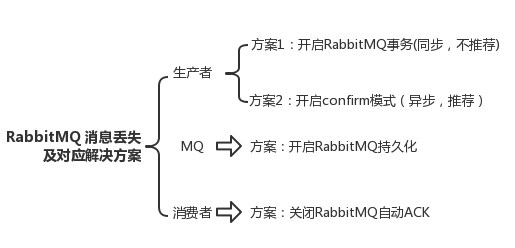

## rabbimq
### 七种模式介绍与应用场景
##### 简单模式（Hello World）

    
做最简单的事情，一个生产者对应一个消费者，RabbitMQ相当于一个消息代理，负责将A的消息转发给B

应用场景：将发送的电子邮件放到消息队列，然后邮件服务在队列中获取邮件并发送给收件人

##### 工作队列模式（Work queues）

在多个消费者之间分配任务（竞争的消费者模式），一个生产者对应多个消费者，一般适用于执行资
源密集型任务，单个消费者处理不过来，需要多个消费者进行处理

应用场景：一个订单的处理需要10s，有多个订单可以同时放到消息队列，然后让多个消费者同时处理，
这样就是并行了，而不是单个消费者的串行情况

##### 订阅模式（Publish/Subscribe）

一次向许多消费者发送消息，一个生产者发送的消息会被多个消费者获取，也就是将消息将广播到所有的消费者中。

应用场景：更新商品库存后需要通知多个缓存和多个数据库，这里的结构应该是：

    一个fanout类型交换机扇出两个个消息队列，分别为缓存消息队列、数据库消息队列
    一个缓存消息队列对应着多个缓存消费者
    一个数据库消息队列对应着多个数据库消费者

##### 路由模式（Routing）

有选择地（Routing key）接收消息，发送消息到交换机并且要指定路由key ，消费者将队列绑定到交换机时需要指
定路由key，仅消费指定路由key的消息

应用场景：如在商品库存中增加了1台iphone12，iphone12促销活动消费者指定routing key为iphone12，只有此促销
活动会接收到消息，其它促销活动不关心也不会消费此routing key的消息
    
##### 主题模式（Topics）
 

根据主题（Topics）来接收消息，将路由key和某模式进行匹配，此时队列需要绑定在一个模式上，#匹配一个词或多
个词，*只匹配一个词。  

应用场景：同上，iphone促销活动可以接收主题为iphone的消息，如iphone12、iphone13等

##### 远程过程调用（RPC）
 

如果我们需要在远程计算机上运行功能并等待结果就可以使用RPC，具体流程可以看图。应用场景：需要等待接口返回
数据，如订单支付

应用场景：对于消息可靠性要求较高，比如钱包扣款

参考链接：https://segmentfault.com/a/1190000040126023

### 高级特性
##### ACK（confirm机制） 
##### 幂等性 
        用户对于同一操作发起的一次请求或者多次请求的结果是一致的
        主流实现方案:唯一ID+指纹码
##### return机制 
        用于处理一些不可路由的消息。也是生产段添加的一个监听。
##### 限流
        假设我们有这样的场景 Rabbitmq服务器有上万条未处理的消息,我们随便打开一个Con - Client,
        会造成:巨量的消息瞬间全部推送过来,然而我们单个客户端无法同时处理这么多数据!此时很有可
        能导致服务器崩溃，严重的可能导致线上的故障。 
        还有一些其他的场景，比如说单个Pro一分钟产生了几百条数据,但是单个Con一分钟可能只能处理
        60条,这个时候Pro-Con肯定是不平衡的。通常Pro是没办法做限制的。所以Con肯定需要做一些限流
        措施，否则如果 超出最大负载，可能导致Con性能下降，服务器卡顿甚至崩溃等一系列严重后果
##### 重回队列 
        重回队列是为了对没有处理成功的消息,将消息重新投递给Broker 
        重回队列,会把消费失败的消息重新添加到队列的尾端,供Con继续消费 
        一般在实际应用中,都会关闭重回队列,即设置为false
##### TTL 
        TTL(Time To Live),即生存时间 
        RabbitMQ支持消息的过期时间，在消息发送时可以进行指定 
        RabbitMQ支持为每个队列设置消息的超时时间，从消息入队列开始计算，只要超过了队列的超时时间
        配置，那么消息会被自动清除
##### 死信队列
        DLX - 死信队列(dead-letter-exchange) 利用DLX,当消息在一个队列中变成死信 (dead message) 之后,
        它能被重新publish到另一个Exchange中,这个Exchange就是DLX
        使用场景：消息被拒绝(basic.reject / basic.nack),并且requeue = false 消息因TTL过期 队列达到最大长度

参考链接：
https://juejin.cn/post/6844903865339346957    

https://segmentfault.com/a/1190000020329477

https://gitee.com/573059382/coder-programming
    
### 常見問題
##### 如何保证消息百分百投递成功 
    方案一:消息信息落库,对消息状态进行打标(常见方案)
    方案二:消息的延迟投递，做二次确认，回调检查（不常用，大厂在用的高并发方案）
##### 如何保证RabbitMQ不被重复消费
    保证消息的唯一性，就算是多次传输，不要让消息的多次消费带来影响；保证消息等幂性；
    比如：在写入消息队列的数据做唯一标识，消费消息时，根据唯一标识判断是否消费过；
##### RabbitMQ和Kafka:如何处理消息丢失问题
###### 生产者弄丢了数据
    1.RabbitMQ提供的事务功能
    2.开启confirm 模式
    事务机制和 confirm 机制最大的不同在于，事务机制是同步的，你提交一个事务之后会阻塞在那儿，但是 confirm 
    机制是异步的，你发送个消息之后就可以发送下一个消息，然后那个消息 RabbitMQ 接收了之后会异步回调你的一个
    接口通知你这个消息接收到了。
    所以一般在生产者这块避免数据丢失，都是用 confirm 机制的。
###### RabbitMQ 弄丢了数据
    开启 RabbitMQ 的持久化
###### 消费端弄丢了数据
    RabbitMQ 提供的 ack 机制
    

参考链接：https://segmentfault.com/a/1190000040394882
##### RabbitMQ和Kafka:如何保证消息的顺序性 
###### 为什么要保证顺序
    消息队列中的若干消息如果是对同一个数据进行操作，这些操作具有前后的关系，必须要按前后的顺序执行，
    否则就会造成数据异常。
    例如，业务上产生三条消息，分别是对数据的增加、修改、删除，而如果没有保证顺序消费，结果可能是删除、
    修改、增加，本来数据最终要删除、结果变成增加。
    参考链接：https://segmentfault.com/a/1190000040394974
###### 解决方案
    一个Queue对应一下Consumer，把需要保证顺序的message都发送到一个Queue当中，关闭autoack，prefetchCount=1，
    每次只消费一条信息，处理过后进行手工ack，然后接收下一条message，只是由一个Consumer进行处理。
    
### 代码实战     
##### PHP实战RabbitMQ之延时队列篇
     参考链接：https://segmentfault.com/a/1190000022774099
     

https://mp.weixin.qq.com/s?__biz=MzIwMTg3NzYyOA==&mid=2247483858&idx=1&sn=2855220277c7c0ba4c1eea7824ea1684&chksm=96e670c1a191f9d7044c274552313fd46346f9192299a36841cd29c5294546335e3706d6968d&token=2058502909&lang=zh_CN&scene=21#wechat_redirect
     
https://mp.weixin.qq.com/s?__biz=MzIwMTg3NzYyOA==&mid=2247483863&idx=1&sn=a3dd04abbcd11a3a823761dd3f50d3c1&chksm=96e670c4a191f9d2cc2f044d8ce6545994560d57153618a8210d381b481419aa869beeadd135&token=1195735466&lang=zh_CN&scene=21#wechat_redirect

https://mp.weixin.qq.com/s?__biz=MzIwMTg3NzYyOA==&mid=2247483867&idx=1&sn=c8abadc68fd40a662d7992a941d9a6e1&chksm=96e670c8a191f9de5f6a663eb44a905397526c94fa1dd929091644be4b4c24251eef82efb48e&token=822843029&lang=zh_CN&scene=21#wechat_redirect

https://mp.weixin.qq.com/s?__biz=MzIwMTg3NzYyOA==&mid=2247483858&idx=1&sn=2855220277c7c0ba4c1eea7824ea1684&chksm=96e670c1a191f9d7044c274552313fd46346f9192299a36841cd29c5294546335e3706d6968d&token=1195735466&lang=zh_CN&scene=21#wechat_redirect

https://mp.weixin.qq.com/s?__biz=MzIwMTg3NzYyOA==&mid=2247483875&idx=1&sn=0192f99cf8b0c1123f03ca4b392266e7&chksm=96e670f0a191f9e618dc4b143ec62698d945525348593794bfbaf567283fb3a1b37cfe9a9624&token=740701108&lang=zh_CN&scene=21#wechat_redirect

https://mp.weixin.qq.com/s?__biz=MzIwMTg3NzYyOA==&amp;mid=2247483879&amp;idx=1&amp;sn=b3f89d2cb50271727b27e04a315c0a0f&amp;chksm=96e670f4a191f9e208248fd6006926a3a7c45209646e871e8115180ee45b7ebd4e287862a456&amp;token=1187527588&amp;lang=zh_CN#rd

